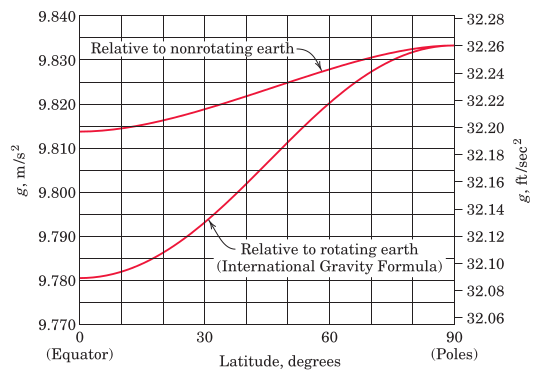

#+TITLE:  introduction
#+AUTHOR: Fethi Okyar
#+DATE: 2025-09-30
#+SUBTITLE: ME 244.3
#+DESCRIPTION: 
#+STARTUP: overview
#+REVEAL_THEME: simple
#+REVEAL_INIT_OPTIONS: slideNumber:"c/t", width:1920, height:1080
#+REVEAL_TITLE_SLIDE: <h2>%t</h2> <h3>%s</h3> <h4>%d</h4>
#+OPTIONS: timestamp:nil toc:1 num:t
#+REVEAL_EXTRA_CSS: ../style.css
#+REVEAL_ROOT: https://cdn.jsdelivr.net/npm/reveal.js
#+HTML_HEAD_EXTRA: 

* History
#+ATTR_REVEAL: :frag (appear)
- Galilei
- Huygens, the watch
- Newton
- Euler
- D'Alembert
- Lagrange
- ...

* Basic Concepts
#+ATTR_REVEAL: :frag (appear)
- Space
- Time
- Mass
- Force
** Dimensions and Units
#+ATTR_REVEAL: :frag (appear)
- L
- T
- M
- F
** Dimensional Analysis
physical laws/relations must be dimensionally homogeneous
* Gravitation
#+ATTR_REVEAL: :frag (appear)
- gravitational constant, $G$
- gravitational acceleration w.r.t. the earth, $\boldsymbol{g}$

** Question
#+ATTR_HTML: :width 900px

#+ATTR_REVEAL: :frag (appear)
- $\boldsymbol{g}$ depends on the altitude, $h$, measured from the sea level
- $\boldsymbol{g}$ depends on the latitude, $\phi$, measured from the equatorial plane
- $\boldsymbol{g}$ depends on the rotational motion of the earth

** Appearant Weight
Ask chatGPT:

[[https://chat.openai.com/?q=what+is+appearant+weight+in+the+context+of+elementary+mechanics][What is appearant weight?]]

* Review
From [[https://docs.google.com/file/d/0Bw8MfqmgWLS4V0NFR2dVUWpuYzg][the book]]: Chapter 1, Review Problems
