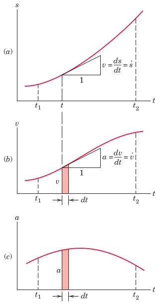
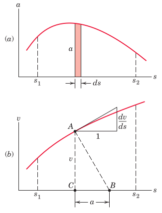
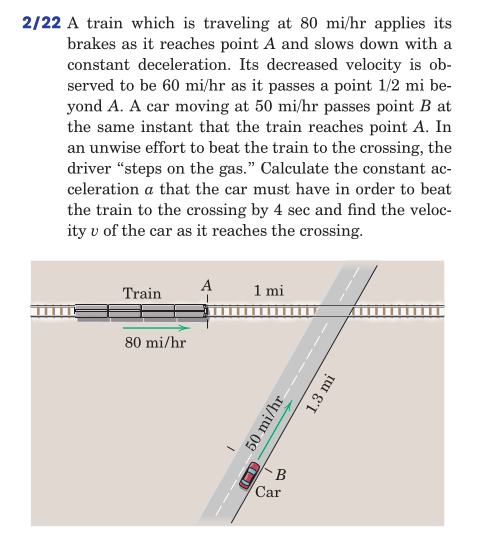

#+TITLE:  rectilinear motion
#+AUTHOR: Fethi Okyar
#+DATE: 2025-09-30
#+SUBTITLE: Particle Kinematics
#+DESCRIPTION: 
#+STARTUP: overview
#+REVEAL_THEME: simple
#+REVEAL_INIT_OPTIONS: slideNumber:"c/t", width:1920, height:1080
#+REVEAL_TITLE_SLIDE: <h2>%t</h2> <h3>%s</h3> <h4>%d</h4>
#+OPTIONS: timestamp:nil toc:1 num:t
#+REVEAL_EXTRA_CSS: ../style.css
#+REVEAL_ROOT: https://cdn.jsdelivr.net/npm/reveal.js
#+HTML_HEAD_EXTRA: 

* Particle Kinematics
- kinematics is the study of ...

** Bodies, Particles
- Bodies may be regarded as particles when ...

** Motion Measurements
*** Linear pathways
Needs
- a clock
- a ruler
- determine amount displacement and the time passed
  
*** Curved pathways
#+ATTR_HTML: :width 500px
[[./meriam/figure_2.1.png]]

** Coordinates
- Cartesian:
- Cylindrical:
- Spherical:
- Curvilinear ??

* Rectilinear Motion
- Define motion
- use the limit concept from calculus
- velocity
- acceleration
- establish a differential relating $s$, $\dot{s}$, and $\ddot{s}$
  
** Graphical Interpretation
*** Time-domain plots
#+ATTR_HTML: :width 500px

*** Phase plots
#+ATTR_HTML: :width 500px

* Examples
*** Problem 2.22 ([[https://docs.google.com/file/d/0Bw8MfqmgWLS4V0NFR2dVUWpuYzg][the book]])
#+ATTR_HTML: :width 500px

* Review
From [[https://docs.google.com/file/d/0Bw8MfqmgWLS4V0NFR2dVUWpuYzg][the book]]: Chapter 2.2, Problems
