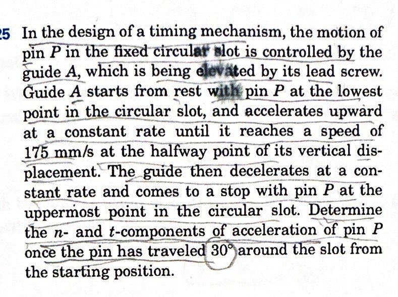
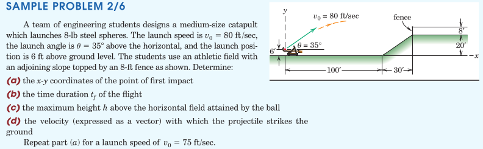
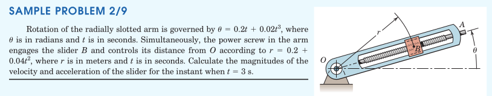

#+TITLE:  curvilinear motion
#+AUTHOR: Fethi Okyar
#+DATE: 2025-10-01
#+SUBTITLE: Particle Kinematics
#+DESCRIPTION: 
#+STARTUP: overview
#+REVEAL_THEME: simple
#+REVEAL_INIT_OPTIONS: slideNumber:"c/t", width:1920, height:1080
#+REVEAL_TITLE_SLIDE: <h2>%t</h2> <h3>%s</h3> <h4>%d</h4>
#+OPTIONS: timestamp:nil toc:1 num:t
#+REVEAL_EXTRA_CSS: ../style.css
#+REVEAL_ROOT: https://cdn.jsdelivr.net/npm/reveal.js
#+HTML_HEAD_EXTRA: 

* Plane Curvilinear Motion
- motion within a plane
- the path trajectory
- the path variable, $s$

** Description without Coordinates
- change in placement, $\Delta\boldsymbol{r}$
- velocity, $\boldsymbol{v}=\dot{\boldsymbol{r}}$
- velocity magnitude, $v=\dot{s}$

** Acceleration
- change in velocity, $\Delta\boldsymbol{v}$
- acceleration, $\boldsymbol{a}=\dot{\boldsymbol{v}}$

* $n-t$ /Natural/ Coordinates
- normal and tangent to the path
- natural unit vectors ($\boldsymbol{e}_n$ and $\boldsymbol{e}_t$)
- center of  curvature, $C$,  and the radius of curvature, $\rho$
- rotation about $C$
- velocity is aligned with the tangent

** Acceleration Components
- tangential acceleration, $a_t = \ddot{s}$
- normal acceleration

** Examples
#+ATTR_HTML: :width 900px
[[./meriam/prob_S2.7.png]]

#+REVEAL: split
#+ATTR_HTML: :width 900px
[[./meriam/prob_S2.8.png]]

#+REVEAL: split
#+ATTR_HTML: :width 800px
[[./meriam/prob_O2.121.jpg]]

#+REVEAL: split
#+ATTR_HTML: :width 650px

#+ATTR_HTML: :width 500px
[[./meriam/prob_O2.125.jpg]]

* $x-y$ /Cartesian/ Coordinates
- motion is expressed in terms of unit vectors, $\boldsymbol{i}$ and $\boldsymbol{j}$
- the unit vectors are fixed (they do not move during the motion), and their differentials are thus zero.
- $\boldsymbol{r} = x \boldsymbol{i} + y \boldsymbol{j}$
- $\boldsymbol{v} = \dot{\boldsymbol{r}} = \dot{x} \boldsymbol{i} + \dot{y} \boldsymbol{j}$
- $\boldsymbol{a} = \ddot{\boldsymbol{r}} = \ddot{x} \boldsymbol{i} + \ddot{y} \boldsymbol{j}$

** Projectile Motion
- if the gravity direction coincides with one of the Cartesian axes (e.g. $-y$ direction), then the acceleration components decompose
- $a_x=0$ and $a_y=-g$ (if all effects other than gravity can be excluded)
- Then the integration of the equations of motion from acceleration becomes possible
** Examples
#+ATTR_HTML: :width 1600px

* $r-\theta$ /Polar/ Coordinates
- motion is expressed in terms of unit vectors, $\boldsymbol{e}_r$ and $\boldsymbol{e}_\theta$
- the unit vectors reorient themselves with location (they rotate during the motion)
- differentials of the unit vectors are not zero
  \[ d\boldsymbol{e}_r =  d\theta\,\boldsymbol{e}_\theta \,\mathrm{and}\; d\boldsymbol{e}_\theta = -d\theta\,\boldsymbol{e}_r\]
- $\boldsymbol{r} = r \boldsymbol{e}_r$
- velocity and acceleration is found by differentiating $\boldsymbol{r}$ with respect to time.

** Circular Motion
  - when the motion is circular, the radius $r$ stays fixed and $\dot{r}=0$
  - The kinematic equations are simplified accordingly.
    
** Examples
  #+ATTR_HTML: :width 1600px
  
  
* Review
From [[https://oxvard.wordpress.com/wp-content/uploads/2018/05/engineering-mechanics-dynamics-7th-edition-j-l-meriam-l-g-kraige.pdf][the book]]: Section 2.4, 2.5, and 2.6, Problems

From Hibbeler, Engineering Mechanics: Dynamics: Chapter 12, F37, F38, 100, 113, 115, 121, 124, 128, 147, 153, 169, 175, 177, 179, 180, 182, 184, 186, 188, 192, 194
