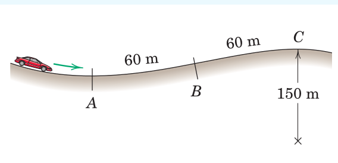
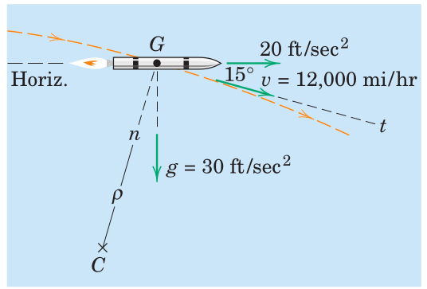
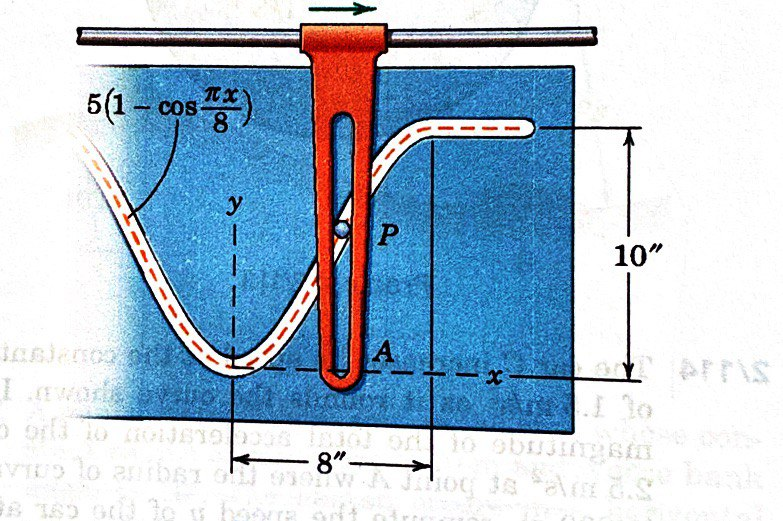
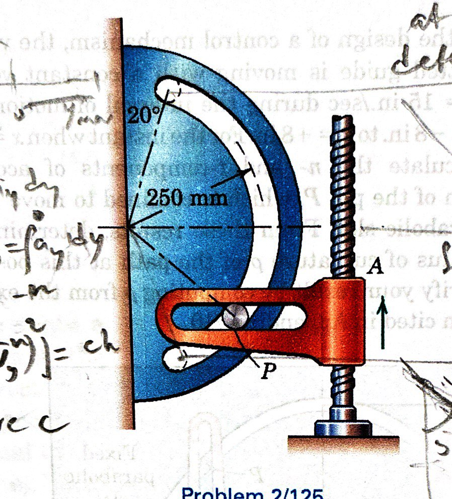

#+TITLE:  curvilinear motion
#+AUTHOR: Fethi Okyar
#+DATE: 2025-09-30
#+SUBTITLE: Particle Kinematics
#+DESCRIPTION: 
#+STARTUP: overview
#+REVEAL_THEME: simple
#+REVEAL_INIT_OPTIONS: slideNumber:"c/t", width:1920, height:1080
#+REVEAL_TITLE_SLIDE: <h2>%t</h2> <h3>%s</h3> <h4>%d</h4>
#+OPTIONS: timestamp:nil toc:1 num:t
#+REVEAL_EXTRA_CSS: ../style.css
#+REVEAL_ROOT: https://cdn.jsdelivr.net/npm/reveal.js
#+HTML_HEAD_EXTRA: 

* Plane Curvilinear Motion
- motion within a plane
- the path trajectory
- the path variable, $s$

** Description without Coordinates
- change in placement, $\Delta\boldsymbol{r}$
- velocity, $\boldsymbol{v}=\dot{\boldsymbol{r}}$
- velocity magnitude, $v=\dot{s}$

** Acceleration
- change in velocity, $\Delta\boldsymbol{v}$
- acceleration, $\boldsymbol{a}=\dot{\boldsymbol{v}}$

* n-t Coordinates
- normal and tangent to the path
- natural unit vectors ($\boldsymbol{e}_n$ and $\boldsymbol{e}_t$)
- center of  curvature, $C$,  and the radius of curvature, $\rho$
- rotation about $C$
- velocity is aligned with the tangent

** Acceleration Components
- tangential acceleration, $a_t = \ddot{s}$
- normal acceleration

* Examples
#+ATTR_HTML: :width 900px

#+REVEAL: split
#+ATTR_HTML: :width 900px

#+REVEAL: split
#+ATTR_HTML: :width 900px

#+REVEAL: split
#+ATTR_HTML: :width 700px

* Review
From [[https://docs.google.com/file/d/0Bw8MfqmgWLS4V0NFR2dVUWpuYzg][the book]]: Chapter 2.5, Problems
