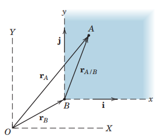
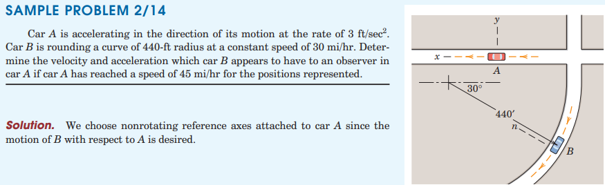
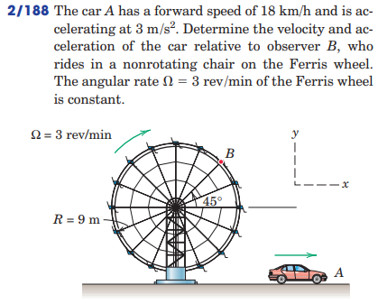

#+TITLE:  relative motion
#+AUTHOR: Fethi Okyar
#+DATE: 2025-10-13
#+SUBTITLE: Particle Kinematics
#+DESCRIPTION: 
#+STARTUP: overview
#+REVEAL_THEME: simple
#+REVEAL_INIT_OPTIONS: slideNumber:"c/t", width:1920, height:1080
#+REVEAL_TITLE_SLIDE: <h2>%t</h2> <h3>%s</h3> <h4>%d</h4>
#+OPTIONS: timestamp:nil toc:1 num:t
#+REVEAL_EXTRA_CSS: ../style.css
#+REVEAL_ROOT: https://cdn.jsdelivr.net/npm/reveal.js
#+HTML_HEAD_EXTRA: 

* Relative Motion between Systems in Translation
- An /inertial/ reference frame (coordinate system) is assumed to be stationary
- Coordinate measurements may be taken from frames attached to moving particles
- This section is about relating the inertial and moving measurements.
  
*** Relating Inertial and Moving Measurements
- The moving reference frame $B$ has an inertial position reading: $\boldsymbol{r}_B$
- Object $A$ has a position reading in the moving frame: $\boldsymbol{r}_{A/B}$
  (reads as position of $A$ relative to $B$)
- The position of $A$ relative to the inertial frame can be found as: $\boldsymbol{r}_A = \boldsymbol{r}_{A/B} + \boldsymbol{r}_B$
  
#+ATTR_HTML: :width 800px

* Examples
#+ATTR_HTML: :width 1600px

#+REVEAL: split
#+ATTR_HTML: :width 900px

* Review
From [[https://oxvard.wordpress.com/wp-content/uploads/2018/05/engineering-mechanics-dynamics-7th-edition-j-l-meriam-l-g-kraige.pdf][the book]]: Section 2.8, Problems

From Hibbeler, Engineering Mechanics: Dynamics: Chapter 12, 180, 182, 184, 186, 188, 192, 194
