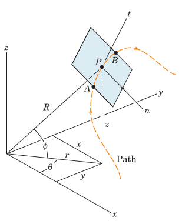

#+TITLE:  constrained motion
#+AUTHOR: Fethi Okyar
#+DATE: 2025-10-13
#+SUBTITLE: Particle Kinematics
#+DESCRIPTION: 
#+STARTUP: overview
#+REVEAL_THEME: simple
#+REVEAL_INIT_OPTIONS: slideNumber:"c/t", width:1920, height:1080
#+REVEAL_TITLE_SLIDE: <h2>%t</h2> <h3>%s</h3> <h4>%d</h4>
#+OPTIONS: timestamp:nil toc:1 num:t
#+REVEAL_EXTRA_CSS: ../style.css
#+REVEAL_ROOT: https://cdn.jsdelivr.net/npm/reveal.js
#+HTML_HEAD_EXTRA: 

* Constrained Particle Motion
- kinematics is the study of ...

** Bodies, Particles
- Bodies may be regarded as particles when ...

** Motion Measurements
*** Linear pathways
Needs
- a clock
- a ruler
- determine amount displacement and the time passed
  
*** Curved pathways
#+ATTR_HTML: :width 500px

* Examples

* Review
From [[https://oxvard.wordpress.com/wp-content/uploads/2018/05/engineering-mechanics-dynamics-7th-edition-j-l-meriam-l-g-kraige.pdf][the book]]: Section 2.9, Problems

From Hibbeler, Engineering Mechanics: Dynamics: Chapter 12, 147, 153, 169, 175, 177, 179
