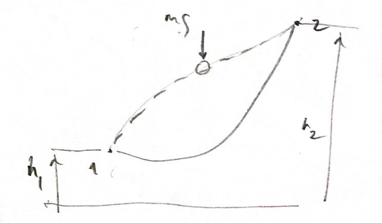
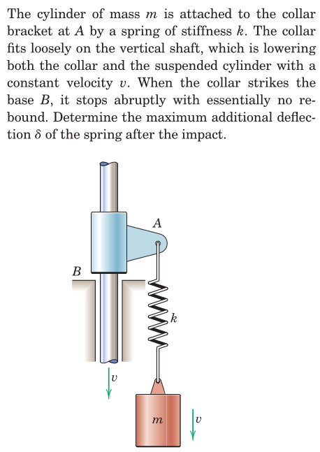

#+TITLE:  kinetics of masses/angular momentum
#+AUTHOR: Fethi Okyar
#+DATE: 2025-11-12
#+SUBTITLE: Particle Kinetics
#+DESCRIPTION: 
#+STARTUP: overview
#+REVEAL_THEME: simple
#+REVEAL_INIT_OPTIONS: slideNumber:"c/t", width:1920, height:1080
#+REVEAL_TITLE_SLIDE: <h2>%t</h2> <h3>%s</h3> <h4>%d</h4>
#+OPTIONS: timestamp:nil toc:1 num:t
#+REVEAL_EXTRA_CSS: ../style.css
#+REVEAL_ROOT: https://cdn.jsdelivr.net/npm/reveal.js
#+HTML_HEAD_EXTRA: 

* Angular Motion
Linear motion is insufficient in describing the dynamics of motion that involves *rotations* in addition to translations.\\

(PICTURE)\\

EXAMPLE: A system of two masses connected by a rigid link rotating about the center of the link, zero linear momentum yet motion prevails.

** a new vector type for a new notion
As linear momentum runs short of the description of rotational motion, there is a need to introduce this type of motion with a new vector.\\

(PICTURE)\\

For that, an observation point $O$ is introduced about which rotational effects are described.
\[ \boldsymbol{r} \times \boldsymbol{G} = \boldsymbol{H}^O \]

(Note that the rotational vectors resulting from the cross product (e.g. rotation, moment, angular moment, etc.) have a different nature compared with ordinary (e.g. force) vectors. Their designation include a double-arrow.)

** revisiting the cross-product operation
The mathematics of the cross-product operation involves cyclic permutations of the argument vector components.\\
 
\begin{align}
\boldsymbol{H}^O =
\left\{
\begin{array}{l}
H_x^O \\
H_y^O \\
H_z^O
\end{array}
\right\}
\end{align}

*** reminder: cross-product of a force about a point 

* Linear Momentum

** notion of momentum
#+ATTR_HTML: :width 800px

#+REVEAL: split
- In

*** equation of motion (revisited)

** balance of momentum principle

*** integrating the equation of motion *in time*
**** form one

**** form two

*** impulse-momentum diagram

*** conservation of momentum

* Examples

#+REVEAL: split
#+ATTR_HTML: :width 700px

* Review
From Hibbeler, Engineering Mechanics: Dynamics: Chapter 15:
