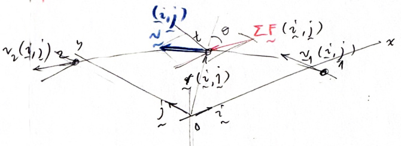
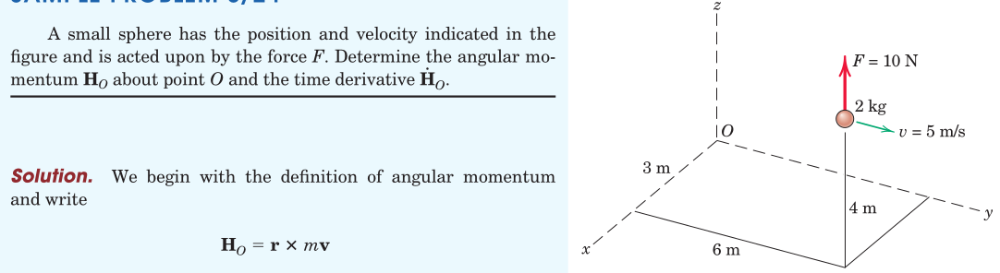
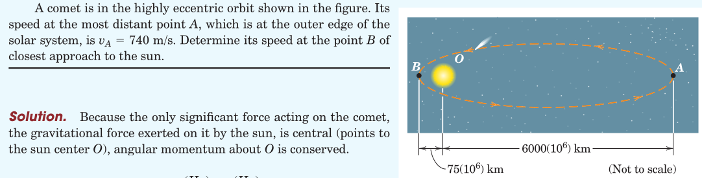
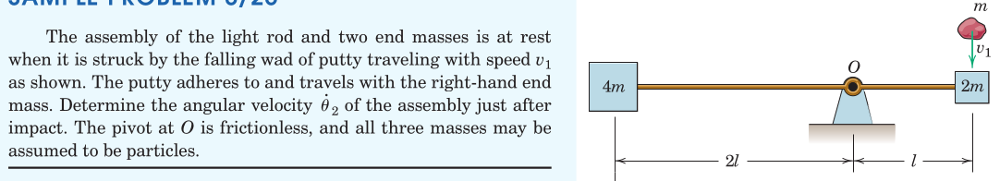
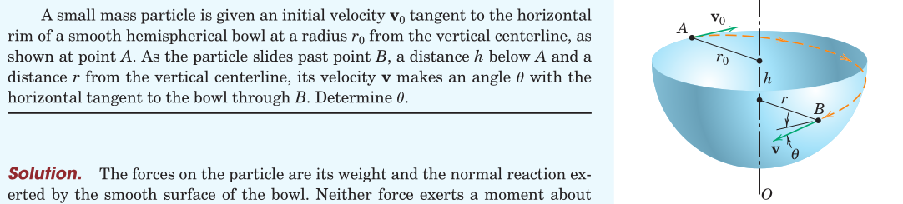

#+TITLE:  kinetics of masses/angular momentum
#+AUTHOR: Fethi Okyar
#+DATE: 2025-11-12
#+SUBTITLE: Particle Kinetics
#+DESCRIPTION: 
#+STARTUP: overview
#+REVEAL_THEME: simple
#+REVEAL_INIT_OPTIONS: slideNumber:"c/t", width:1920, height:1080
#+REVEAL_TITLE_SLIDE: <h2>%t</h2> <h3>%s</h3> <h4>%d</h4>
#+OPTIONS: timestamp:nil toc:1 num:t
#+REVEAL_EXTRA_CSS: ../style.css
#+REVEAL_ROOT: https://cdn.jsdelivr.net/npm/reveal.js
#+HTML_HEAD_EXTRA: 

* Angular Motion
Linear motion is insufficient in describing the dynamics of motion that involves *rotations* in addition to translations.\\

(PICTURE)\\

EXAMPLE: A system of two masses connected by a rigid link rotating about the center of the link, zero linear momentum yet motion prevails.

** Angular Equation of Motion
We remind that the equation of motion for a mass (or a system of masses)
\[ \sum_i \boldsymbol{F}_i = \dot{\boldsymbol{G}} \]

runs short of describing angular effects. For that purpose we introduce a point $O$ about which rotational effect is observed. By taking the cross product of the equation of motion with the position vector $\boldsymbol{r}$ from $O$ we get
\[ \boldsymbol{r} \times \sum_i \boldsymbol{F}_i = \boldsymbol{r} \times \dot{\boldsymbol{G}} \]

We can define two new quantities that appear on both sides of the equal sign.

** The Resultant Moment about $O$
On the left of the angular equation of motion, the cross product of the position vector from $O$ with the resultant forces appeared. This is called as $\boldsymbol{M}^O$ as
\[ \sum_i \boldsymbol{M}^O = \boldsymbol{r} \times \sum_i \boldsymbol{F}_i \]

On the right side of the angular equation of motion is another story (following the next slide)

*** revisiting the cross-product operation
The mathematics of the cross-product operation involves cyclic permutations of the argument vector components.\\
 
\begin{align}
\boldsymbol{M}^O =
\left\{
\begin{array}{l}
M_x^O \\
M_y^O \\
M_z^O
\end{array}
\right\} = \ldots
\end{align}

** A New Vector Type for A New Notion
On the right of the angular equation of motion we introduce another type of momentum with a new vector type.\\

(PICTURE)\\

This will be called as the angular momentum of mass $m$ about point $O$, $\boldsymbol{H}^O$, and expressed as 
\[ \boldsymbol{H}^O = \boldsymbol{r} \times \boldsymbol{G} \]

Note that the rotational vectors resulting from the cross product (e.g. rotation, moment, angular velocity, angular moment, etc.) have a different nature compared with ordinary (e.g. force) vectors. Their designation includes a double-arrow.

*** The Rate of Change of Angular Momentum
Upon taking the rate of change of angular momentum we get
\[ \dot{\boldsymbol{H}^O} = \dot{\boldsymbol{r}} \times \boldsymbol{G} + \boldsymbol{r} \times \dot{\boldsymbol{G}} \]

But as $\dot{\boldsymbol{r}}=\boldsymbol{v}$ is parallel to $\boldsymbol{G}$, the first term vanishes.

* The Balance of Angular Momentum Principle
Now the angular equation of motion can be restated in terms of the newly defined notions as
\[ \sum_i \boldsymbol{M}^O = \dot{\boldsymbol{H}^O} \]

which reads
#+BEGIN_QUOTE
The moment about an observer $O$ of all forces acting on mass $m$ (or a system of masses) equals the time rate of change of angular momentum of $m$ (or a system of masses) about $O$.
#+END_QUOTE

The vector equation can be decomposed into it's scalar components.

** differential of the principle
The above expression can be integrated in time to obtain the angular impulse-momentum relation which will be practical to solve simple problems in dynamics.\\

Before integration we need to express the balance of angular moment principle in its differential form as
\[ \sum_i \boldsymbol{M}^O dt = d \boldsymbol{H}^O \]

#+REVEAL: split
*form one*\\
Integrating the equations of motion from time $t_1$ to time $t_2$, we have
\[ \int_{t_1}^{t_2} \sum_i \boldsymbol{M}^O dt = (\boldsymbol{H}^O)_2 - (\boldsymbol{H}^O)_1 \]

#+REVEAL: split
*form two*\\
Form One can also be rewritten as
\[  (\boldsymbol{H}^O)_1 + \int_{t_1}^{t_2} \sum_i \boldsymbol{M}^O dt = (\boldsymbol{H}^O)_2 \]

which reads
#+BEGIN_QUOTE
Total angular impulse on $m$ about point $O$ equals the corresponding change in angular momentum of $m$ about $O$.
#+END_QUOTE

** Units
- angular impulse has units of (N $\cdot$ m) $\cdot$ s
- angular momentum has units of  $\ldots$

* Applications in Two-Dimensional Model Space
A reduction from 3-D model space becomes possible when the motion of the mechanical system is constrained to a plane.

#+ATTR_HTML: :width 900px

In this case, the 6 degrees-of-freedoms (dofs) are reduced to 3.
- there will be two active translational dofs, (e.g. $x$ and $y$)
- there will be one active rotational dof ($z$)

** consequence of reduction in model space
- we can write two equations of motion in plane ($x$ and $y$)
- we can write one angular equation of motion out of plane ($z$)
  \[  (H_z^O)_1 + \int_{t_1}^{t_2} \sum_i M_z^O dt = (H_z^O)_2 \]
- the rest of equations (translation along $z$ and rotation about $x$ and $y$) become equations of equilibrium.

* Examples
#+ATTR_HTML: :width 1600px

#+REVEAL: split
#+ATTR_HTML: :width 1600px

#+REVEAL: split
#+ATTR_HTML: :width 1600px

#+REVEAL: split
#+ATTR_HTML: :width 1600px

* Review
From Hibbeler, Engineering Mechanics: Dynamics: Chapter 15:
