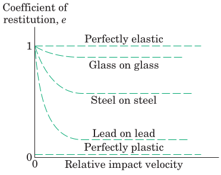
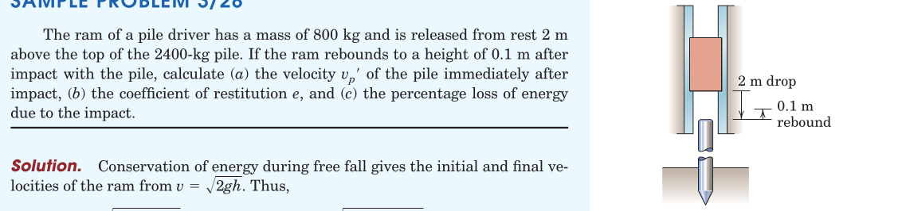
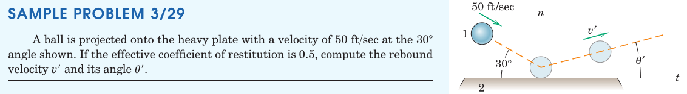
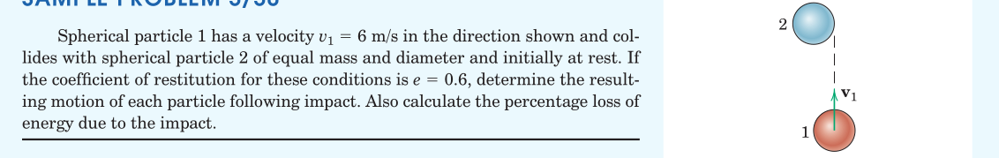
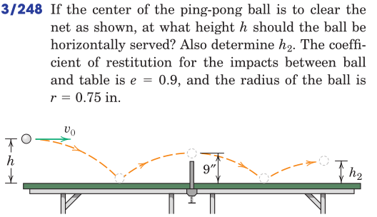
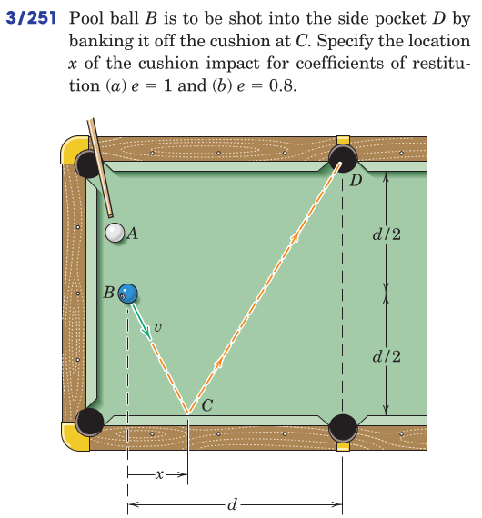
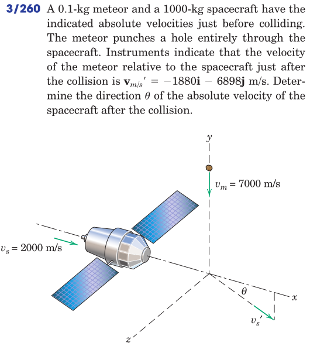
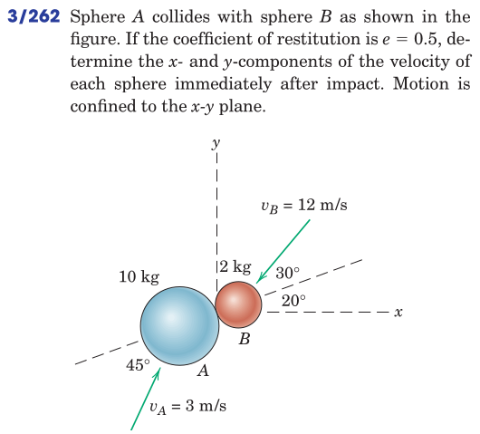

#+TITLE:  kinetics of masses/impact
#+AUTHOR: Fethi Okyar
#+DATE: 2025-11-18
#+SUBTITLE: Particle Kinetics
#+DESCRIPTION: 
#+STARTUP: overview
#+REVEAL_THEME: simple
#+REVEAL_INIT_OPTIONS: slideNumber:"c/t", width:1920, height:1080
#+REVEAL_TITLE_SLIDE: <h2>%t</h2> <h3>%s</h3> <h4>%d</h4>
#+OPTIONS: timestamp:nil toc:1 num:t
#+REVEAL_EXTRA_CSS: ../style.css
#+REVEAL_ROOT: https://cdn.jsdelivr.net/npm/reveal.js
#+HTML_HEAD_EXTRA: 

* Impact
Colliding bodies with a relatively large contact force over a very brief interval of time.

The impact process:
- involves energy conversion between kinetic, elastic, acoustic forms as well as dissipation of heat,
- can be studied in two consecutive phases known as the deformation and rebound/restoration.\\

[free-hand sketch of the phases of impact: approach, engagement, separation]

#+REVEAL: split
Types of impact:
- central: contact forces generated by impact happen to be centroidal
  + direct: velocities are parallel to the contact forces
  + oblique
- otherwise: contact forces are not centoidal
  
** Direct Central Impact
Here both masses travel in the same direction, before and after impact\\

[free-hand sketch of the collinear collision phases]

Given the two masses and initial velocities $v^a$ and $v^b$ (note only magnitudes of the forces are shown as the direction is known) we inquire the separation velocities $v'^a$ and $v'^b$.

#+REVEAL: split
The two equations required are obtained from
1. conservation of momentum along the direction of motion
   \[ m^a v^a + m^b v^b = m^a v'^a + m^b v'^b \]
2. the coefficient of restitution 

*** Coefficient of Restitution, $e$
This is a measure of the energy loss during impact between the deformation and rebound phases.
\[ e = \frac{\mathrm{impulse_{rebound}}}{\mathrm{impulse_{deform}}} = \frac{\int_{t_p}^T F_r dt}{\int_0^{t_p} F_d dt} \]

[free-hand sketch of the impact phases with an adjacent time-force diagram]

The impulse period $[0,T]$ is split into the deformation period $[0,t_p]$ and the rebound period $[t_p,T]$, where $t_p$ indicates the peak time.

#+REVEAL: split
Using the impulse-momentum relations we can write (for both particles separately):
\begin{align}
 m^a v^a - \int_0^{t_p} F_d dt &= m^a \bar{v} \\
 m^a \bar{v} - \int_{t_p}^T F_r dt &= m^a v'^a \\
 m^b v^b + \int_0^{t_p} F_d dt &= m^b \bar{v} \\
 m^b \bar{v} + \int_{t_p}^T F_r dt &= m^b v'^b 
\end{align}

#+REVEAL: split
Upon substitution into the coefficient of restitution formula for both particles and eliminating $\bar{v}$ we obtain
\[ e = \frac{v'^b - v'^a}{v^a - v^b} \]
which is the second equation required to solve for the unknown rebound velocities.

#+REVEAL: split
Note that $e$ is an empirical constant (similar to the coefficient of friction) obtained from experiments between different materials.
#+ATTR_HTML: :width 700px

** Energy Loss Calculation
The energy lost during the impact due to $e<1$ can be found by subtracting the sum of kinetic energies for the system of particles during the approach and separation phases.
\[ \Delta E = \Delta T \]
The loss of energy is attributed to
1. converted to inelastic deformation than dissipated in the form of heat
2. dissipation of elastic wave energy in the form of heat
3. energy converted to acoustic energy, i.e. sound
   
** Oblique Central Impact
[free-hand sketch of the phases of oblique central impact]

Given initial conditions $\boldsymbol{v}^a$ and $\boldsymbol{v}^b$, we find the velocity components in the directions normal and tangential to impact. The four unknowns of the separation phase become $v'^a_n$, $v'^a_t$, $v'^b_n$ and $v'^b_t$

The four equations that can be used to solve these are
1. conservation of momentum of the _system of masses_ in the $n-$direction
2. conservation of momentum of _each particle_ in the $t-$direction
3. coefficient of restitution in the $n-$direction

* Examples
#+ATTR_HTML: :width 1600px

#+ATTR_HTML: :width 1600px

#+ATTR_HTML: :width 1600px

#+REVEAL: split
#+ATTR_HTML: :width 700px

#+REVEAL: split
#+ATTR_HTML: :width 700px

#+REVEAL: split
#+ATTR_HTML: :width 700px

#+REVEAL: split
#+ATTR_HTML: :width 700px

* Review
From Hibbeler, Engineering Mechanics: Dynamics: Chapter 15: 
