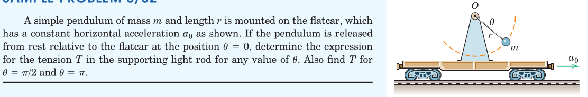
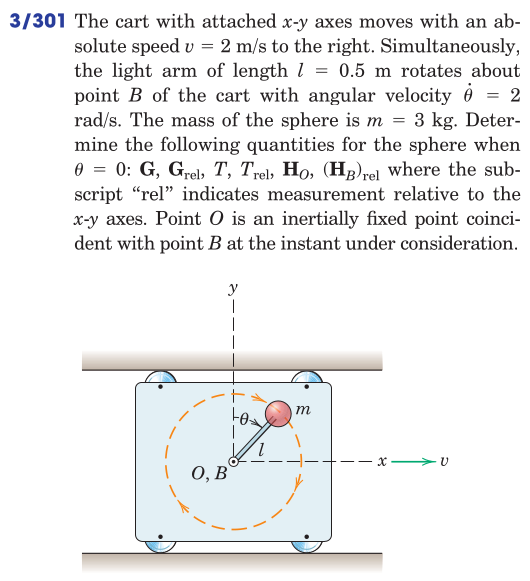
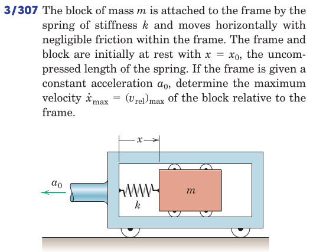
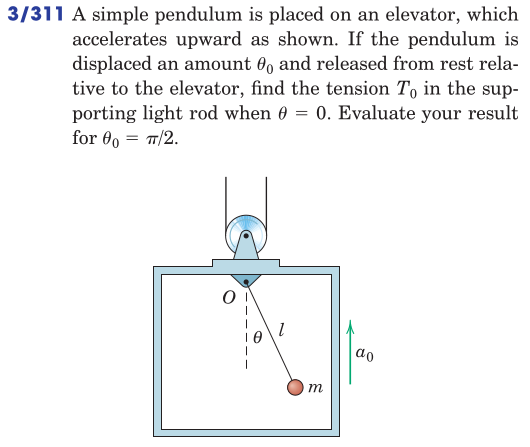

#+TITLE:  kinetics of masses/relative motion
#+AUTHOR: Fethi Okyar
#+DATE: 2025-11-18
#+SUBTITLE: Particle Kinetics
#+DESCRIPTION: 
#+STARTUP: overview
#+REVEAL_THEME: simple
#+REVEAL_INIT_OPTIONS: slideNumber:"c/t", width:1920, height:1080
#+REVEAL_TITLE_SLIDE: <h2>%t</h2> <h3>%s</h3> <h4>%d</h4>
#+OPTIONS: timestamp:nil toc:1 num:t
#+REVEAL_EXTRA_CSS: ../style.css
#+REVEAL_ROOT: https://cdn.jsdelivr.net/npm/reveal.js
#+HTML_HEAD_EXTRA: 

* Relativity?
Are we really operating on a fixed reference frame?\\
What is an astronomical frame of reference, does is exist?

[a freehand depiction of earth's rotation around the sun and the our rotation about the globe's axis]

#+REVEAL: split
Everthing is in relative motion.

[a freehand picture of a mass moving with respect to a frame of reference in motion]

\[ \boldsymbol{a}_A = \boldsymbol{a}_B + \boldsymbol{a}_\mathrm{rel} \]

If the acceleration of the moving coordinate system can be neglected, i.e., $\boldsymbol{a}_B << \boldsymbol{a}_\mathrm{rel}$ then

\[ \boldsymbol{a}_A \approx \boldsymbol{a}_\mathrm{rel} \]

* Validity Tests on Principles
The linear momentum of mass
\[ \boldsymbol{G} = m\boldsymbol{v}_A = m (\boldsymbol{v}_B + \boldsymbol{v}_\mathrm{rel}) \]

The rate of change of linear momentum
\[ \dot{\boldsymbol{G}} = m \dot{\boldsymbol{v}}_A = m ({\dot{\boldsymbol{v}}_B} + \dot{\boldsymbol{v}}_\mathrm{rel}) \approx m \dot{\boldsymbol{v}}_\mathrm{rel} \]

Same is true for the angular momentum
\[ \dot{\boldsymbol{H}_O} = \boldsymbol{r} \times m ({\dot{\boldsymbol{v}}_B} + \dot{\boldsymbol{v}}_\mathrm{rel}) \approx \boldsymbol{r} \times m \dot{\boldsymbol{v}}_\mathrm{rel} \]

#+REVEAL: split
The expression of the impulse-linear momentum
\begin{align}
\boldsymbol{G}_1 + \int_i \boldsymbol{F}_i dt &= \boldsymbol{G}_2 \\
m (\boldsymbol{v}_b + \boldsymbol{v}_{\mathrm{rel}1}) +  \int_i \boldsymbol{F}_i dt &= m (\boldsymbol{v}_b + \boldsymbol{v}_{\mathrm{rel}2}) \\
m \boldsymbol{v}_{\mathrm{rel}1} +  \int_i \boldsymbol{F}_i dt &= m \boldsymbol{v}_{\mathrm{rel}2} 
\end{align}
is valid in the moving frame!!

#+REVEAL: split
Similarly the angular impulse-momentum expression
\[ \boldsymbol{r}_\mathrm{rel1} \times m \boldsymbol{v}_{\mathrm{rel}1} +  \int_i \boldsymbol{r}_\mathrm{rel} \times \boldsymbol{F}_i dt = \boldsymbol{r}_\mathrm{rel2} \times m \boldsymbol{v}_{\mathrm{rel}2}  \]
is valid in the moving frame!!
* Examples
#+ATTR_HTML: :width 1600px

#+REVEAL: split
#+ATTR_HTML: :width 700px

#+REVEAL: split
#+ATTR_HTML: :width 700px

#+REVEAL: split
#+ATTR_HTML: :width 700px

* Review
From Hibbeler, Engineering Mechanics: Dynamics: Chapter 15: 
