#+TITLE:  kinetics of bodies in rectilinear translation
#+AUTHOR: Fethi Okyar
#+DATE: 2025-10-22
#+SUBTITLE: Particle Kinetics
#+DESCRIPTION: 
#+STARTUP: overview
#+REVEAL_THEME: simple
#+REVEAL_INIT_OPTIONS: slideNumber:"c/t", width:1920, height:1080
#+REVEAL_TITLE_SLIDE: <h2>%t</h2> <h3>%s</h3> <h4>%d</h4>
#+OPTIONS: timestamp:nil toc:1 num:t
#+REVEAL_EXTRA_CSS: ../style.css
#+REVEAL_ROOT: https://cdn.jsdelivr.net/npm/reveal.js
#+HTML_HEAD_EXTRA: 

* Equations of Motion
- In *statics* problems the basic approach to solve mechanics was by using /equilibrium equations/
  \[ \sum_i \boldsymbol{F}_i = 0 \]
- In *dynamics* we use the /equations of motion/ instead
  \[ \sum_i \boldsymbol{F}_i = m \dot{\boldsymbol{v}} \]
- This is also known as the /force, mass, acceleration/ approach

** methods of approach
In general, we may speak of three approaches to solving problems in dynamics
- force, mass, acceleration
- work-energy principles
- impulse-momentum

* Force, Mass, Acceleration
*Mass* represents the inertia, also known as bodies resistance to a change in its' rate of change of velocity
  \[ \boldsymbol{F} = m \boldsymbol{a} \]
- The units in this equation should be consulted with care
- The acceleration used in the equation of motion should be an inertial measurement.\\
  (It cannot be a measurement relative to a moving reference frame $B$, as in $\boldsymbol{a}^{A/B}$.)

** System of Units
#+ATTR_HTML: :width 1000px
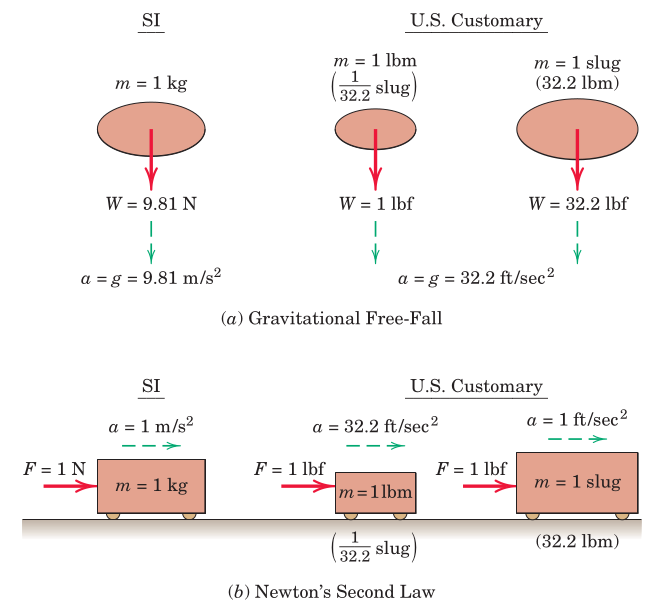

** Solution Properties
- This type of problems (force, mass, acceleration) are of /instantaneous/ nature, i.e., we solve for the mechanics at a given instant in time.
- Two sub-categories can be identified:
  + Motion specified (kinematics driven)\\
    Here, the kinematics (motion) is solved for first, as done in the previous chapter. The forces can be evaluated from the equation of motion, by evaluating the accelerations.
  + Force specified (kinetics driven)\\
    Here, kinematics and kinetics are solved simultaneously. Forces can be specified as a function of time, $t$, position, $s$, or velocity $v$.

** Motion Properties
We talk about two types of motion, in general
- *unconstrained* motion\\
  Here, each body in rectilinear translation is thought to have three dofs, where only one is active (the one in the direction of motion)
- *constrained* motion\\
  Here, the body is constrained from moving in certain directions by some restraining plane(s) that cancel some dofs and bear reaction forces (which may also have to be solved).
  
* Examples
#+ATTR_HTML: :width 1600px
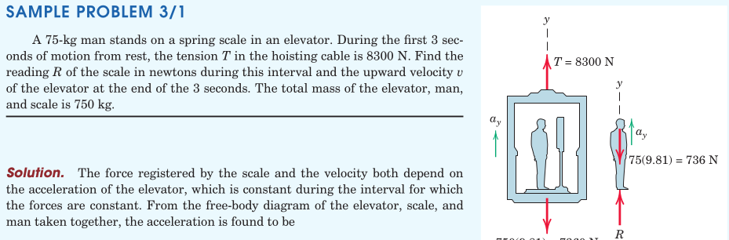

#+REVEAL: split
#+ATTR_HTML: :width 1600px
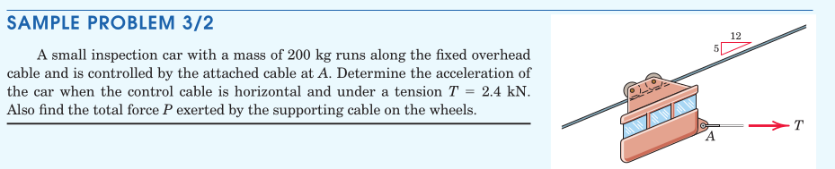

#+REVEAL: split
#+ATTR_HTML: :width 1600px
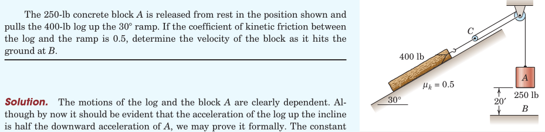

#+REVEAL: split
#+ATTR_HTML: :width 1600px
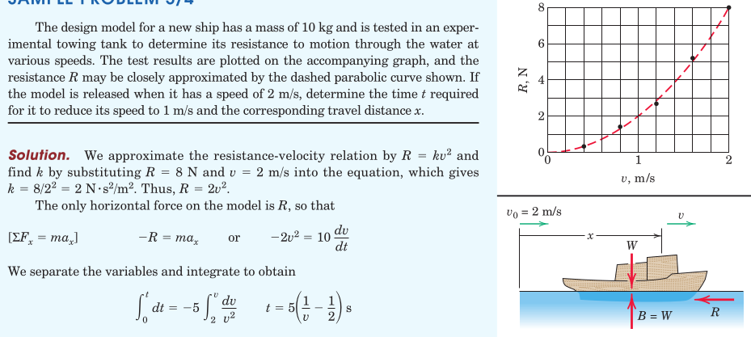

#+REVEAL: split
#+ATTR_HTML: :width 1600px
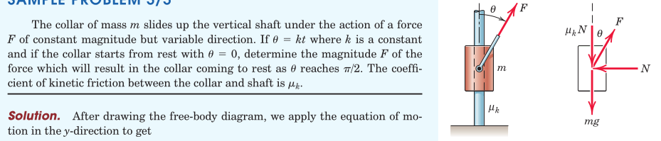

#+REVEAL: split
#+ATTR_HTML: :width 700px
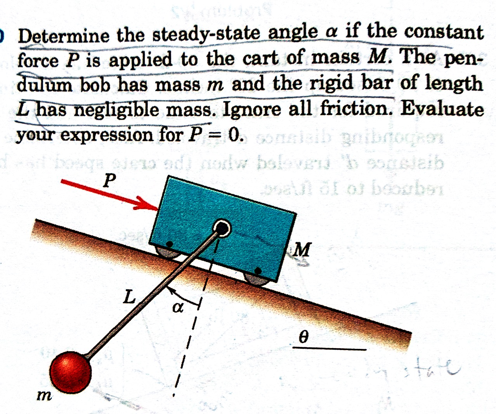

#+REVEAL: split
#+ATTR_HTML: :width 700px
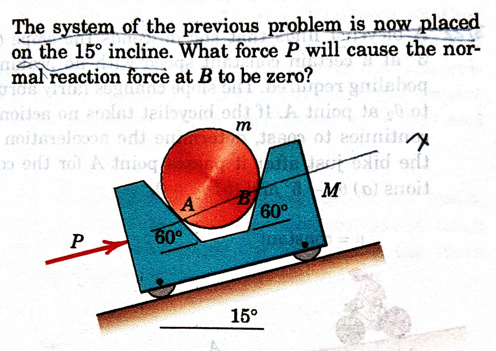

#+REVEAL: split
#+ATTR_HTML: :width 700px
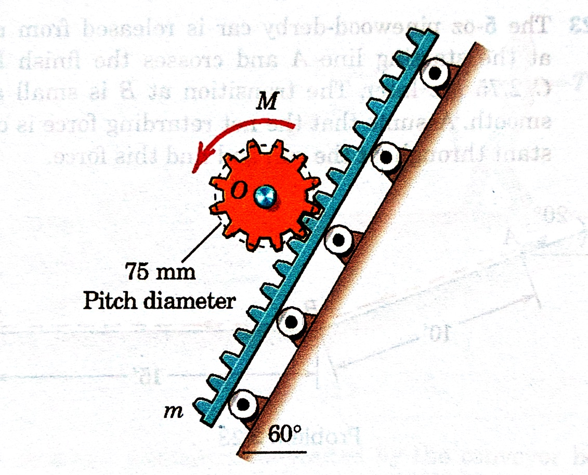

#+REVEAL: split
#+ATTR_HTML: :width 700px
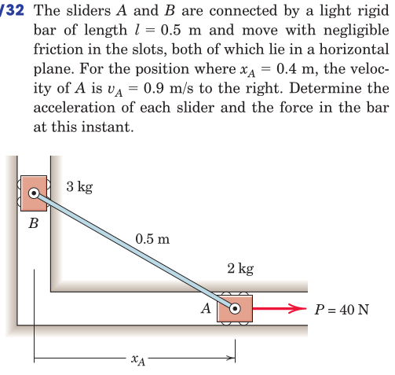

#+REVEAL: split
#+ATTR_HTML: :width 700px
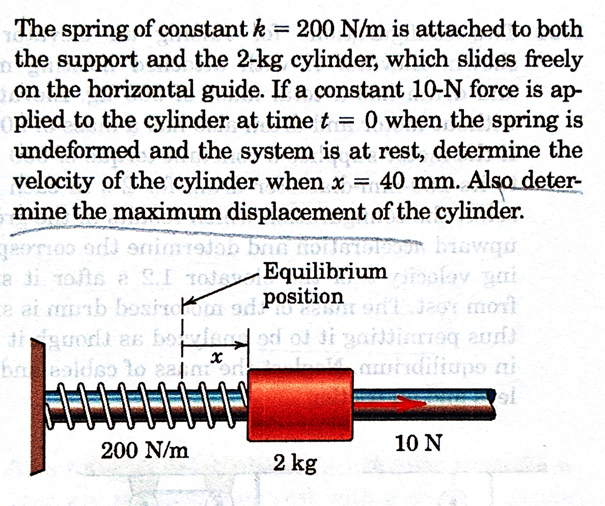

#+REVEAL: split
#+ATTR_HTML: :width 700px
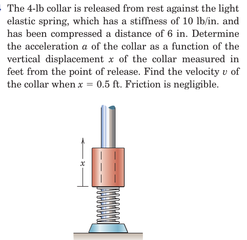

* Review
From [[https://oxvard.wordpress.com/wp-content/uploads/2018/05/engineering-mechanics-dynamics-7th-edition-j-l-meriam-l-g-kraige.pdf][the book]]: Section 3.1-4, Problems

From Hibbeler, Engineering Mechanics: Dynamics: Chapter 13: 3, 7, 15, 20, 24, 25, 41, 42, 47
