#+TITLE:  kinetics of particles in curvilinear motion
#+AUTHOR: Fethi Okyar
#+DATE: 2025-10-26
#+SUBTITLE: Particle Kinetics
#+DESCRIPTION: 
#+STARTUP: overview
#+REVEAL_THEME: simple
#+REVEAL_INIT_OPTIONS: slideNumber:"c/t", width:1920, height:1080
#+REVEAL_TITLE_SLIDE: <h2>%t</h2> <h3>%s</h3> <h4>%d</h4>
#+OPTIONS: timestamp:nil toc:1 num:t
#+REVEAL_EXTRA_CSS: ../style.css
#+REVEAL_ROOT: https://cdn.jsdelivr.net/npm/reveal.js
#+HTML_HEAD_EXTRA: 

* Equations of Motion
- Kinetics of particles moving in curved planar paths require careful consideration of the normal and tangential components, which can be resolved in any one of the below coordinates:
  + rectangular
    \[ \sum_i \boldsymbol{F}_x = m\,\ddot{x} \, , \hspace{1em} \sum_i \boldsymbol{F}_y = m\,\ddot{y} \]
  + cylindrical
    \[ \sum_i \boldsymbol{F}_r = m(\ddot{r} - r \dot{\theta}^2)\, , \hspace{1em} \sum_i \boldsymbol{F}_\theta = m(r\ddot{\theta} + 2\dot{r} \dot{\theta}) \]

* Examples
#+ATTR_HTML: :width 1600px
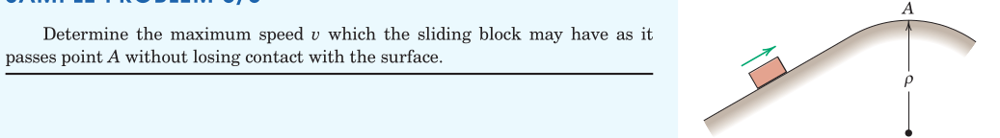

#+REVEAL: split
#+ATTR_HTML: :width 1600px
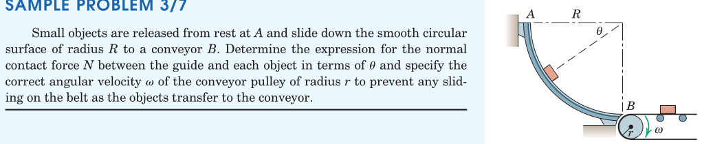

#+REVEAL: split
#+ATTR_HTML: :width 1600px
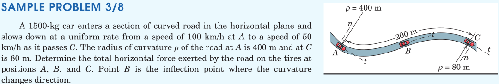

#+REVEAL: split
#+ATTR_HTML: :width 1600px
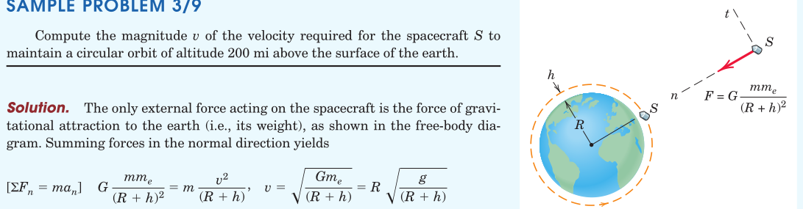

#+REVEAL: split
#+ATTR_HTML: :width 1600px
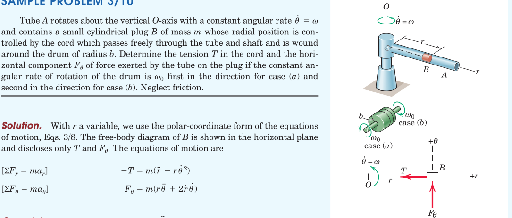

#+REVEAL: split
#+ATTR_HTML: :width 700px
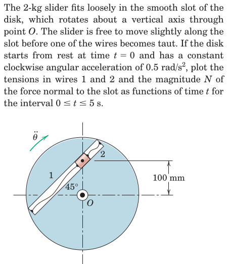

#+REVEAL: split
#+ATTR_HTML: :width 700px
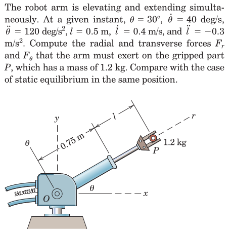

#+REVEAL: split
#+ATTR_HTML: :width 700px
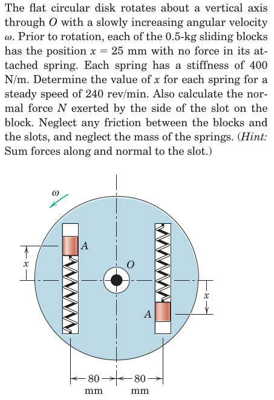

#+REVEAL: split
#+ATTR_HTML: :width 700px
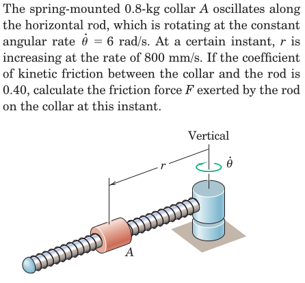

#+REVEAL: split
#+ATTR_HTML: :width 700px
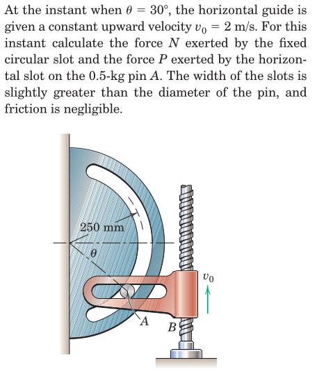

#+REVEAL: split
#+ATTR_HTML: :width 700px
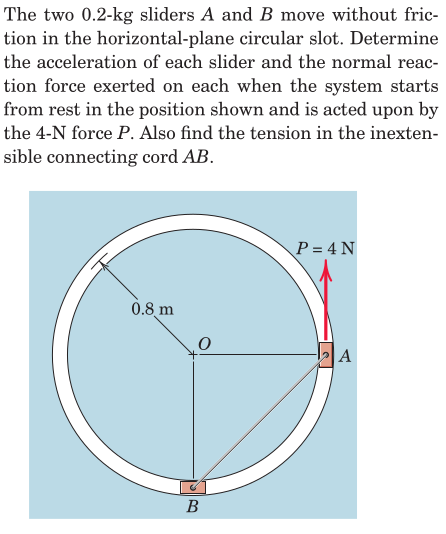

* Review
From [[https://oxvard.wordpress.com/wp-content/uploads/2018/05/engineering-mechanics-dynamics-7th-edition-j-l-meriam-l-g-kraige.pdf][the book]]: Section 3.5, Problems

From Hibbeler, Engineering Mechanics: Dynamics: Chapter 13: 58, 67, 69, 73, 74, 77, 83, 88, 90, 94, 96, 101, 102, 106, 107

