#+TITLE:  kinetics of bodies/work and energy
#+AUTHOR: Fethi Okyar
#+DATE: 2025-11-04
#+SUBTITLE: Particle Kinetics
#+DESCRIPTION: 
#+STARTUP: overview
#+REVEAL_THEME: simple
#+REVEAL_INIT_OPTIONS: slideNumber:"c/t", width:1920, height:1080
#+REVEAL_TITLE_SLIDE: <h2>%t</h2> <h3>%s</h3> <h4>%d</h4>
#+OPTIONS: timestamp:nil toc:1 num:t
#+REVEAL_EXTRA_CSS: ../style.css
#+REVEAL_ROOT: https://cdn.jsdelivr.net/npm/reveal.js
#+HTML_HEAD_EXTRA: 

* Method of Work-Energy
- cumulative effects of forces over
  + a prescribed motion path
  + a period of time
    
  can directly be imported into the equations of motion such that solution without the knowledge of acceleration will be possible.    

** Definition: Incremental Work of an External Force
- External Forces
  + Active
  + Reactive
- Incremental Work
\[ \delta U = \boldsymbol{F} \cdot d\boldsymbol{r} \]

** System of Units
- [force]*[displacement]
- N $\cdot$ m = 1 J
- ft $\cdot$ lb

** Work of a Force over a Path
#+ATTR_HTML: :width 800px
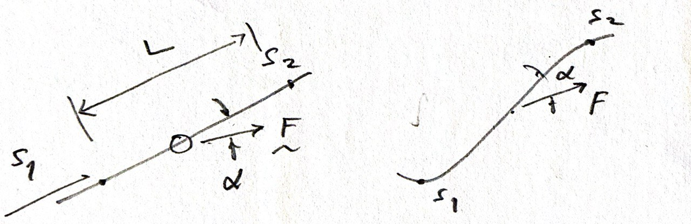

\[  U_{1-2} = \int_1^2 \boldsymbol{F} \cdot d\boldsymbol{r} \]

- straight path
- curved path
  
** Work done by Spring Force
#+ATTR_HTML: :width 800px
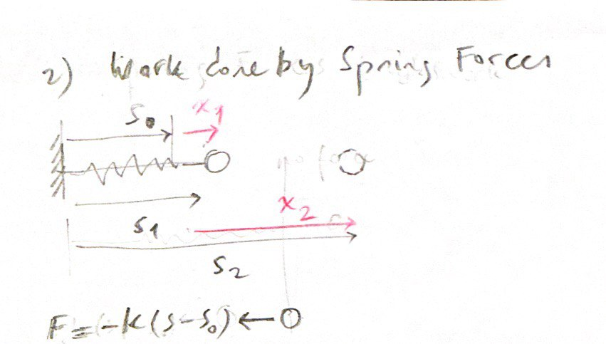

\[  U_{1-2} = -\frac{1}{2} k (x_2^2 - x_1^2) \]

This implies
- negative work while moving away
- positive work while moving towards
  
the springs' undeformed configuration.

*** Elastic Potential
The elastic potential function will be used in the next section.
\[ V^e = \frac{1}{2} k x^2 \]

$x$ is measured from the undeformed spring

** Work done by Gravity
#+ATTR_HTML: :width 500px
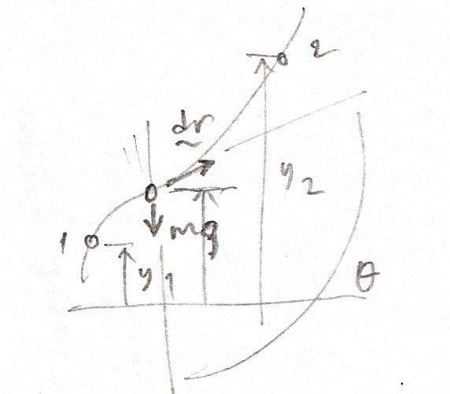

\[  U_{1-2} = -mg(y_2 - y_1) \]

gravity does
- negative work during ascent
- positive work during descent
  
of the mass.

*** Gravitational Potential
The gravitational potential function will be used in the next section.
\[ V^g = mgh \]

* Derivation of Kinetic Energy
\[ T = \frac{1}{2} mv^2 \]
and
\[ U_{1-2} = T_2 - T_1 \]

The total work done by the resultant unbalanced force $F$ in moving the mass from 1 to 2 equals the corresponding change in kinetic energy of the mass.

* Power and Efficiency
** Power
\[ P = F \cdot v \]

** Efficiency
#+ATTR_HTML: :width 500px
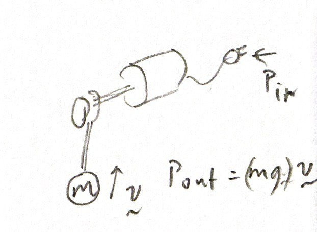

\[ \frac{P_{out}}{P_{in}} \]

* Examples
#+ATTR_HTML: :width 1600px
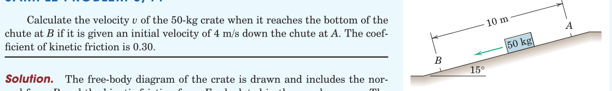

#+REVEAL: split
#+ATTR_HTML: :width 1600px
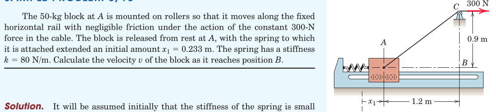

#+REVEAL: split
#+ATTR_HTML: :width 1600px
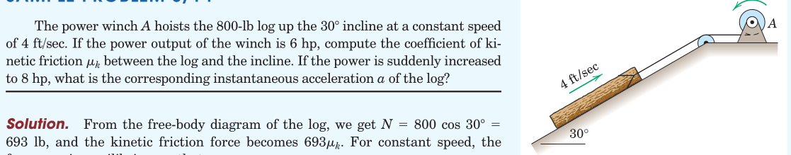

#+REVEAL: split
#+ATTR_HTML: :width 700px
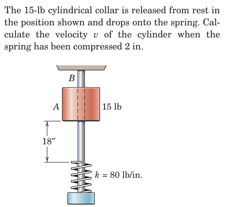

#+REVEAL: split
#+ATTR_HTML: :width 700px
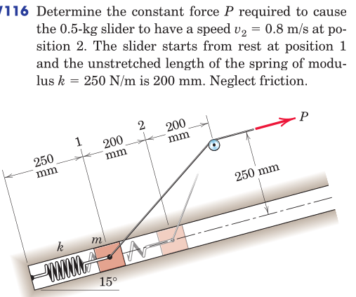

#+REVEAL: split
#+ATTR_HTML: :width 700px
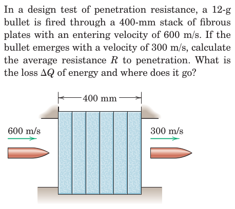

#+REVEAL: split
#+ATTR_HTML: :width 700px
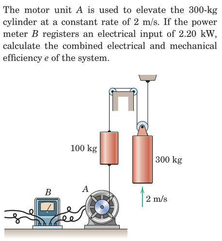

#+REVEAL: split
#+ATTR_HTML: :width 700px
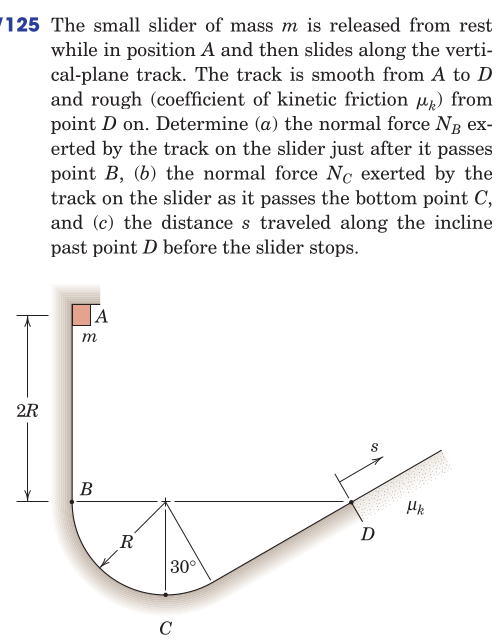

#+REVEAL: split
#+ATTR_HTML: :width 700px
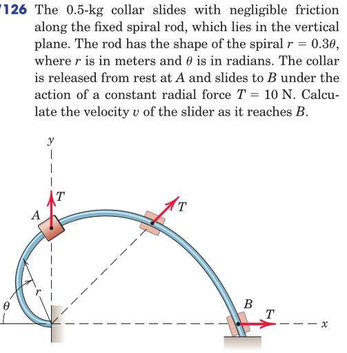

#+REVEAL: split
#+ATTR_HTML: :width 700px
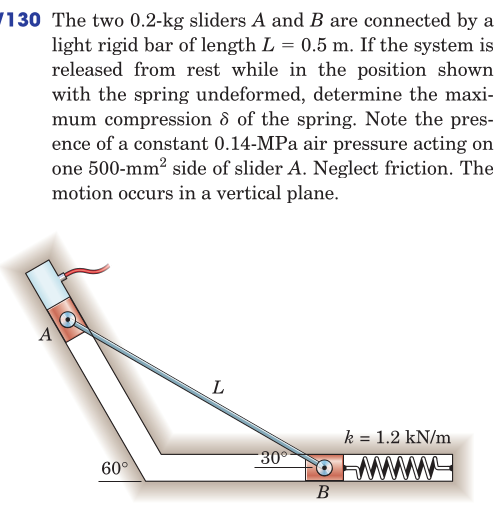

#+REVEAL: split
#+ATTR_HTML: :width 700px
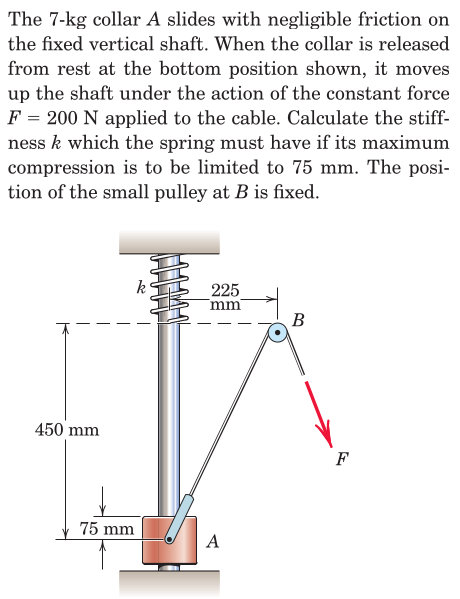

* Review
From Hibbeler, Engineering Mechanics: Dynamics: Chapter 14: 4, 6, 12, 15, 18, 19, 21, 25*, 28, 30, 35, 40, 41 
