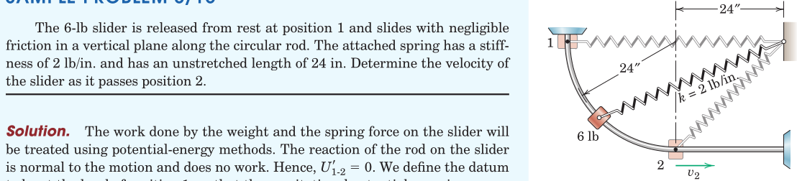
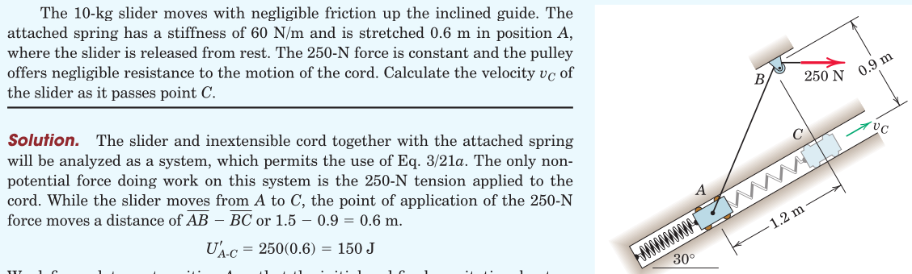
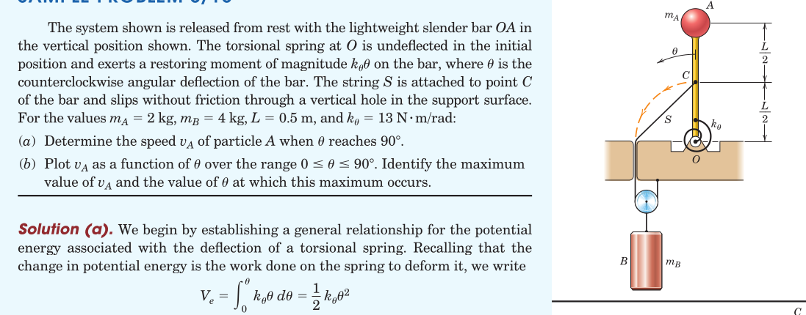
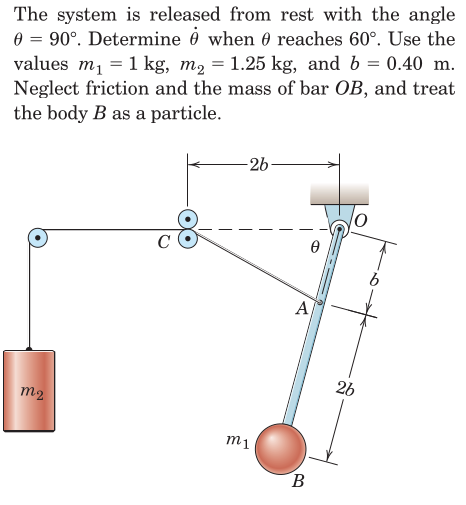
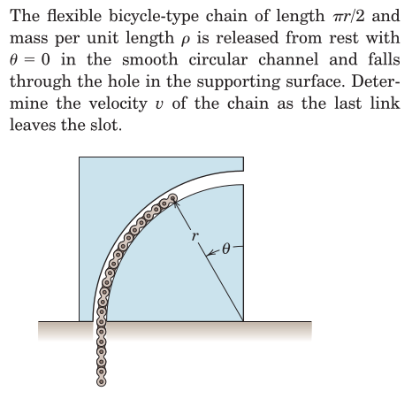
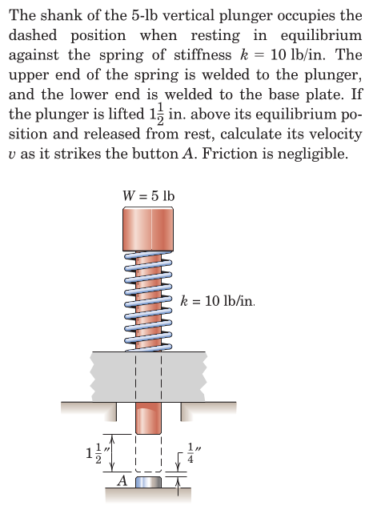
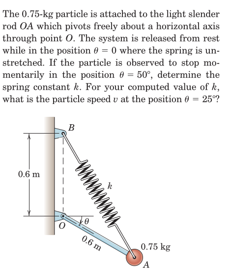
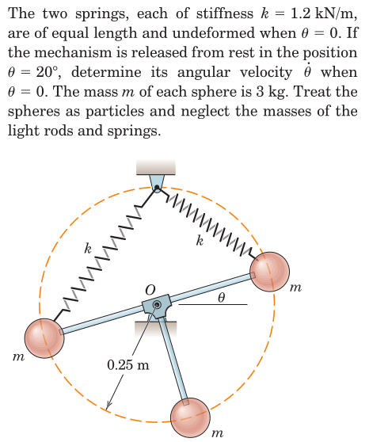
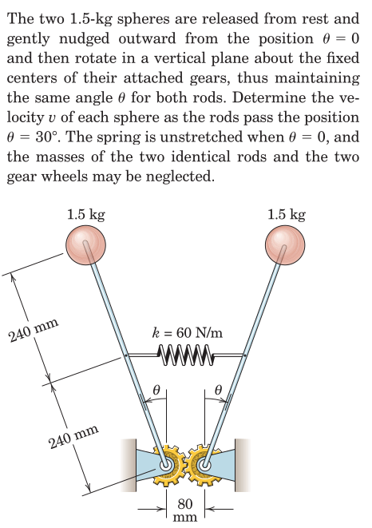
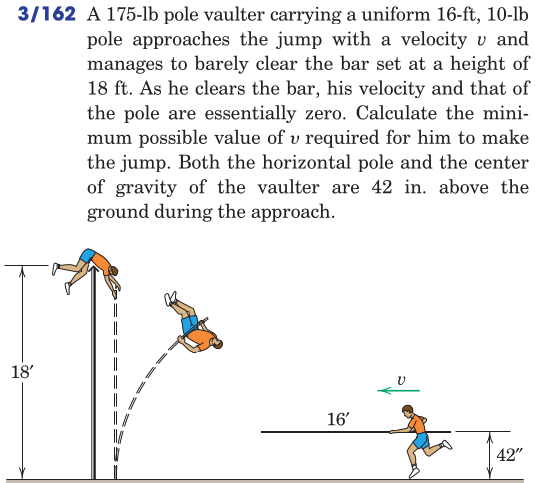

#+TITLE:  kinetics of masses/potential energy
#+AUTHOR: Fethi Okyar
#+DATE: 2025-11-05
#+SUBTITLE: Particle Kinetics
#+DESCRIPTION: 
#+STARTUP: overview
#+REVEAL_THEME: simple
#+REVEAL_INIT_OPTIONS: slideNumber:"c/t", width:1920, height:1080
#+REVEAL_TITLE_SLIDE: <h2>%t</h2> <h3>%s</h3> <h4>%d</h4>
#+OPTIONS: timestamp:nil toc:1 num:t
#+REVEAL_EXTRA_CSS: ../style.css
#+REVEAL_ROOT: https://cdn.jsdelivr.net/npm/reveal.js
#+HTML_HEAD_EXTRA: 

* Potential Functions
- they can be defined as the negative of the work, based only on the initial and final coordinates of the mass, independent of the motion path
  + due to spring forces 
  + due to gravitational attraction
    
** Gravitational Potential
- is a function of the location $h$ along the axis of gravitational acceleration
  \[ V^g = mgh \]
- The change in potential energy in moving a mass $m$ from $h_1$ to $h_2$
  \[  \begin{aligned}
  \Delta V^g &= V^g_2 - V^g_1\\
   &= mg (h_2 - h_1) = mg \Delta h
  \end{aligned}   \]
  is /negative/ of the work done by the gravitational force on the mass.

** Elastic Potential
- is a function of the spring's elastic displacement $x$ from its' undeformed configuration
  \[ V^e = \int_0^x kx\,dx = \frac{1}{2} k x^2 \]
- The change in elastic energy in moving a mass $m$ relatice to the undeformed length from $x_1$ to $x_2$
  \[  \begin{aligned}
  \Delta V^e &= V^e_2 - V^e_1\\
   &= \frac{1}{2} k (x_2^2 - x_1^2)
  \end{aligned}   \]
  is /negative/ of the work done by the spring force on the mass.

** Modified Work-Energy Equation
- The work term $U$ in 
  \[  U_{1-2} = T_2 - T_1 = \Delta T \]
  is modified to $U'$ as
  \[ U'_{1-2} = \Delta T + \Delta V \]
  where $\Delta V = \Delta V^g + \Delta V^e$ is the sum of potentials from gravity and all springs attached while $U'$ stands for the work of all external forces /*other than*/ gravity and spring forces. 
- This equation can also be stated as
  \[ T_1 + V_1 + U'_{1-2} = T_2 + V_2 \]
  
* Conservative Force Fields
#+ATTR_HTML: :width 800px
[[./sketch_3.7.jpg]]

- A force is said to be /conservative/ if the work done by it depends only on the initial and final coordinates (i.e. the work is /path-independent/).

- In this case, we assume (know) that a scalar force potential $V=V(x,y,z)$ exists, such that the negative of its differential $dV$ is equal to $\boldsymbol{F}\cdot d\boldsymbol{r}$.

#+REVEAL: split
- In this way, we conjecture that
  \[ U_{1-2} = \int_{V_1}^{V_2} -dV = -(V_2 - V_1) \]

- The differential $dV$ can be evaluated by using the chain-rule of differentiation as
  \[ dV = \frac{\partial V}{\partial x} dx + \frac{\partial V}{\partial y} dy + \frac{\partial V}{\partial z} dz \]

#+REVEAL: split
But $dV$ is also equivalent to
  \[ F_x dx + F_y dy + F_z dz \]
which implies that
  \[ F_x = \frac{\partial V}{\partial x},\hspace{1em} F_y = \frac{\partial V}{\partial y},\hspace{1em} F_z = \frac{\partial V}{\partial z} \]

#+REVEAL: split
In vector form the relation between the force, $\boldsymbol{F}$ and the force potential $V$ can be expressed as
\[ \boldsymbol{F} = - \nabla V \]
where the symbol $\nabla$ (reads "nabla") is the *vector gradient* operator defines as
\[ \nabla = \frac{\partial}{\partial x} \boldsymbol{i} +  \frac{\partial}{\partial y} \boldsymbol{j} + \frac{\partial}{\partial z} \boldsymbol{k} \]

* Examples
#+ATTR_HTML: :width 1600px

#+REVEAL: split
#+ATTR_HTML: :width 1600px

#+REVEAL: split
#+ATTR_HTML: :width 1600px

#+REVEAL: split
#+ATTR_HTML: :width 700px

#+REVEAL: split
#+ATTR_HTML: :width 700px

#+REVEAL: split
#+ATTR_HTML: :width 700px

#+REVEAL: split
#+ATTR_HTML: :width 700px

#+REVEAL: split
#+ATTR_HTML: :width 700px

#+REVEAL: split
#+ATTR_HTML: :width 700px

#+REVEAL: split
#+ATTR_HTML: :width 700px

#+REVEAL: split
#+ATTR_HTML: :width 700px
[[./meriam/prob_3.163.png]]

* Review
From Hibbeler, Engineering Mechanics: Dynamics: Chapter 14: 48, 49, 53, 58, 71, 72, 76, 78, 84, 92, 93
