#+TITLE:  kinetics of masses/impulse and linear momentum
#+AUTHOR: Fethi Okyar
#+DATE: 2025-11-11
#+SUBTITLE: Particle Kinetics
#+DESCRIPTION: 
#+STARTUP: overview
#+REVEAL_THEME: simple
#+REVEAL_INIT_OPTIONS: slideNumber:"c/t", width:1920, height:1080
#+REVEAL_TITLE_SLIDE: <h2>%t</h2> <h3>%s</h3> <h4>%d</h4>
#+OPTIONS: timestamp:nil toc:1 num:t
#+REVEAL_EXTRA_CSS: ../style.css
#+REVEAL_ROOT: https://cdn.jsdelivr.net/npm/reveal.js
#+HTML_HEAD_EXTRA: 

* Impulse
- Our study of work and energy allowed us to solve problems in dynamics by integrating the equation of motion over *the path*.
- This way, we were able to determine velocities without the need for integrating accelerations.
- Now we consider integrating the equation of motion *in time*.
    
** time integral of forces
#+ATTR_HTML: :width 500px

The notion of impulse and impact may be related. 
\[ \int_{t_1}^{t_2} \boldsymbol{F} dt \]

** temporal nature of force
#+ATTR_HTML: :width 600px
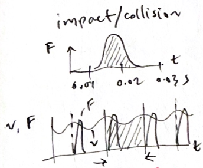

The impulse period $t_1-t_2$ may be very brief as in impact, or the force application may be occurring over repeated (or cyclic) periods, i.e. /periodic/ excitation.

* Linear Momentum
The product of mass and velocity is called the linear momentum, $\boldsymbol{G}$ where
\[ \boldsymbol{G} = m \boldsymbol{v} \]

** equation of motion (revisited)
The equation of motion (for a single mass)
\[ \sum_i \boldsymbol{F}_i = m \dot{\boldsymbol{v}} \]
The right hand side can be generalized for variable mass as
\[ \sum_i \boldsymbol{F}_i = \frac{d}{dt}(m \boldsymbol{v}) \]

*** balance of linear momentum principle
The equation of motion reads
\[ \sum_i \boldsymbol{F}_i = \dot{\boldsymbol{G}} \]

The resultant unbalanced force acting on the mass equals its time rate of change of linear momentum.

*** integrating the equation of motion *in time*
The balance of linear momentum can be converted into a /differential expression/
\[ \sum_i \boldsymbol{F}_i dt = d \boldsymbol{G} \]

#+REVEAL: split
*form one*\\
Integrating the differential expression we get
\[ \int_{t_1}^{t_2} \sum_i \boldsymbol{F}_i dt = \int_{G_1}^{G_2} d (\boldsymbol{G}) = \boldsymbol{G}_2 -  \boldsymbol{G}_1 \]

#+REVEAL: split
*form two*\\
manipulating the equation by moving terms around, we get
\[ \boldsymbol{G}_1 + \int_{t_1}^{t_2} \sum_i \boldsymbol{F}_i dt = \boldsymbol{G}_2 \]

*** impulse-momentum diagram
#+ATTR_HTML: :width 1100px
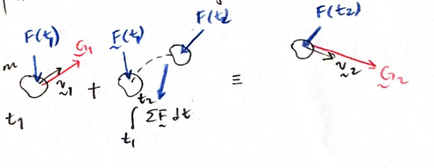

The impulse-momentum equation provides as many terms as *the rank* of model space

*** conservation of momentum
Here we state that
#+BEGIN_QUOTE
if the resultant of forces in a particular direction (or as a whole) remains zero during a period, then the change in linear momentum within that period and particular direction (or as a whole) will be *zero*
#+END_QUOTE

* Examples
#+ATTR_HTML: :width 1600px
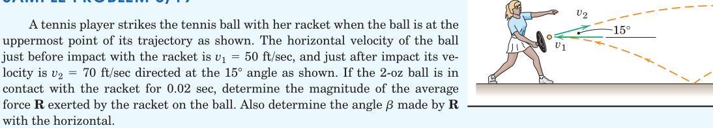

#+REVEAL: split
#+ATTR_HTML: :width 1600px
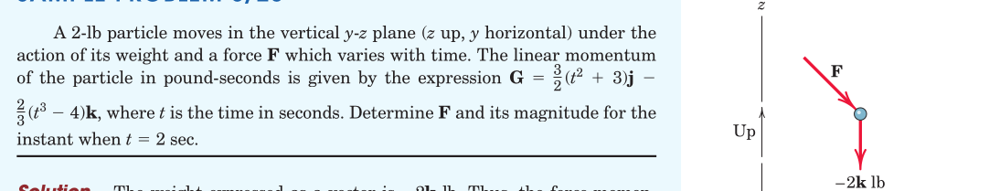

#+REVEAL: split
#+ATTR_HTML: :width 1600px
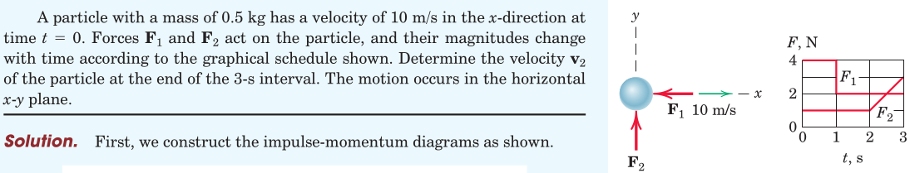

#+REVEAL: split
#+ATTR_HTML: :width 1600px
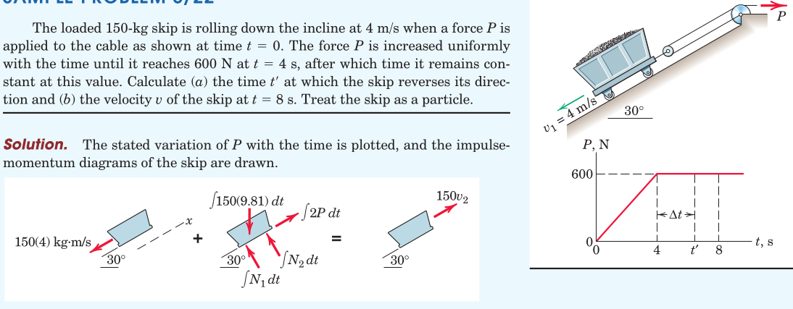

#+REVEAL: split
#+ATTR_HTML: :width 1600px
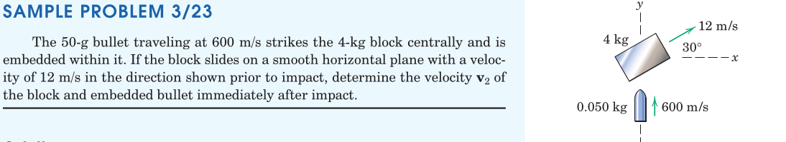

#+REVEAL: split
#+ATTR_HTML: :width 700px
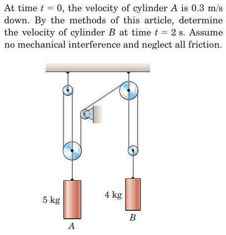

#+REVEAL: split
#+ATTR_HTML: :width 700px
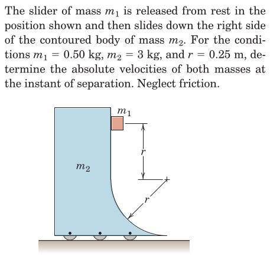

#+REVEAL: split
#+ATTR_HTML: :width 700px
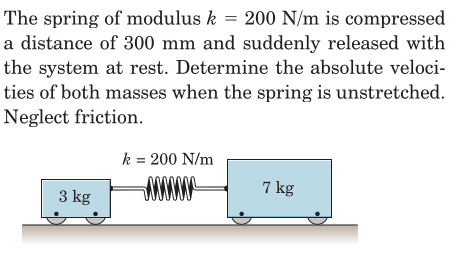

#+REVEAL: split
#+ATTR_HTML: :width 700px
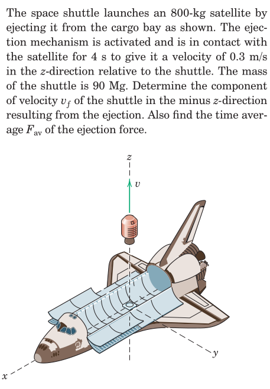

#+REVEAL: split
#+ATTR_HTML: :width 700px
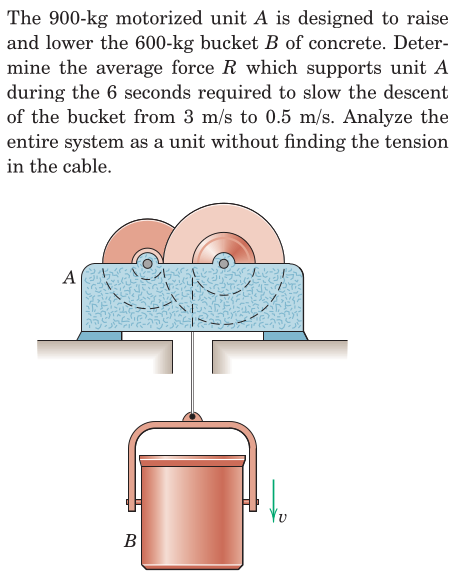

#+REVEAL: split
#+ATTR_HTML: :width 700px
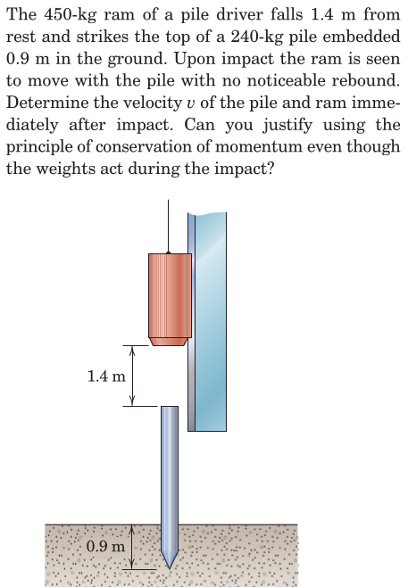

#+REVEAL: split
#+ATTR_HTML: :width 700px
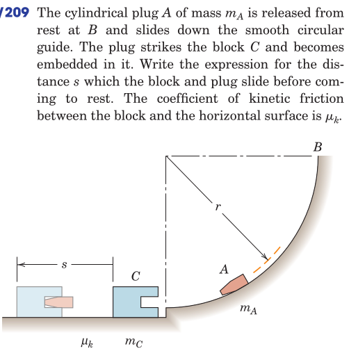

* Review
From Hibbeler, Engineering Mechanics: Dynamics: Chapter 15: 6, 14, 18, 22, 28, 33, 39, 42, 43
