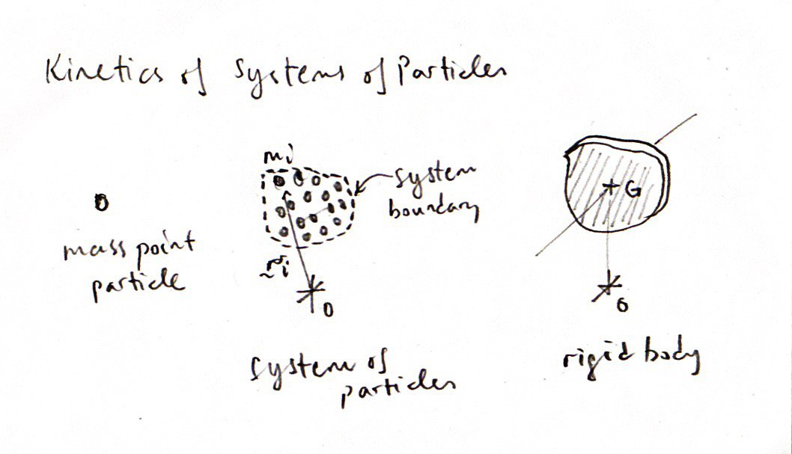
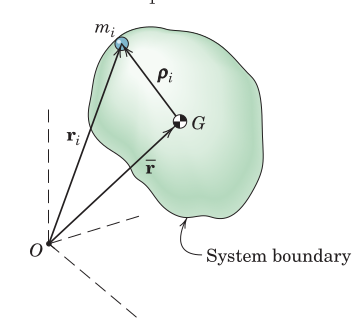
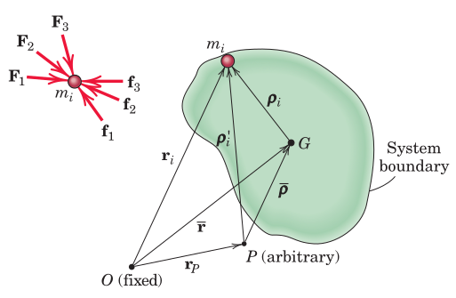

#+TITLE:  kinetics/general equations
#+AUTHOR: Fethi Okyar
#+DATE: 2025-12-09
#+SUBTITLE: Group of Particles
#+DESCRIPTION: 
#+STARTUP: overview
#+REVEAL_THEME: simple
#+REVEAL_INIT_OPTIONS: slideNumber:"c/t", width:1920, height:1080
#+REVEAL_TITLE_SLIDE: <h2>%t</h2> <h3>%s</h3> <h4>%d</h4>
#+OPTIONS: timestamp:nil toc:1 num:t
#+REVEAL_EXTRA_CSS: ../style.css
#+REVEAL_ROOT: https://cdn.jsdelivr.net/npm/reveal.js
#+HTML_HEAD_EXTRA: 

* Newton's 2nd Law for a Group
#+ATTR_HTML: :width 800px

The evolution from particle mechanics to mechanics of rigid bodies.

** Centre of Mass
#+ATTR_HTML: :width 500px

** Equilibrium of Particle $i$
#+ATTR_HTML: :width 500px

** Equilibrium of a Group of Particles

*** Acceleration of $G$, the Center of Mass

* Kinetic Energy of a Group
#+ATTR_HTML: :width 500px

** Kinetic Energy in a Non-Inertial Frame
The kinetic energy of a group of particles can be expressed in terms of their relative velocities measured in a non-inertial frame.

* Momenta of a Group
The linear momentum and moment of momentum (angular momentum) of a group of particles can be determined

** Linear Momentum
[freehand depiction of the particle $i$, the center of mass $G$, and the inertial origin $O$, with position vectors connecting them to each other]

** Moment of Momentum
Moment of linear momentum can also just be called *moment of momentum*, or angular momentum.

#+ATTR_HTML: :width 700px

*** About a Fixed Point, $O$
#+ATTR_HTML: :width 700px

Here the moment of momentum is expressed using the position vectors taken from a fixed (inertial) point $O$.

#+REVEAL: split
*Balance of Moment of Momentum*

The balance of moment of momentum expression required the time derivative of the moment of momentum as well as the moment of external forces about $O$.

*** About the Center of Mass, $G$
#+ATTR_HTML: :width 700px

The moment of momentum can be expressed using relative velocities and accelerations of the particles about their center of mass, $G$.

#+REVEAL: split
*Balance of Moment of Momentum*

*** About an Arbitrary Point, $P$
#+ATTR_HTML: :width 700px

The moment of momentum can also be expressed using the relative velocities and accelerations with respect to an arbitrary non-inertial point, $P$, via its relation with the center of mass, $G$.

#+REVEAL: split
*Balance of Moment of Momentum*

The time derivative of the moment of momentum relative to $G$ can be taken.

#+REVEAL: split
*Alternative Expression About Point $P$*

The moment of momentum about point $P$ can also be expressed using position vectors from point $P$ (without reference to the centre of mass $G$)

#+REVEAL: split
*Balance of Momentum Using the Alternative Expression*

* Review

