#+TITLE:  kinetics of bodies/general plane motion
#+AUTHOR: Fethi Okyar
#+DATE: 2025-11-22
#+SUBTITLE: Rigid-Body Kinematics
#+DESCRIPTION: 
#+STARTUP: overview
#+REVEAL_THEME: simple
#+REVEAL_INIT_OPTIONS: slideNumber:"c/t", width:1920, height:1080
#+REVEAL_TITLE_SLIDE: <h2>%t</h2> <h3>%s</h3> <h4>%d</h4>
#+OPTIONS: timestamp:nil toc:1 num:t
#+REVEAL_EXTRA_CSS: ../style.css
#+REVEAL_ROOT: https://cdn.jsdelivr.net/npm/reveal.js
#+HTML_HEAD_EXTRA: 

* Body vs. Particle
When does the physical shape of a body become irrelevant to its motion?

#+ATTR_HTML: :width 600px
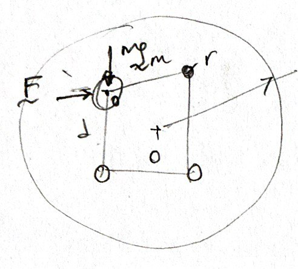

the size and shape does not matter so long as we use the mass center to characterize the location of the mass

#+REVEAL: split
force equilibrium rules while the moment of forces are identically satistifed.
\begin{align}
 \sum_i \boldsymbol{F}_i &= \boldsymbol{F}^R \\
 \sum_i \boldsymbol{r}_Oi \times \boldsymbol{F}_i &= \boldsymbol{M}^R_O = 0
\end{align}

#+REVEAL:split
But when the body becomes the major actor in the theater, it accepts forces that are not necessarily concurrent at its center of mass, then

#+ATTR_HTML: :width 900px
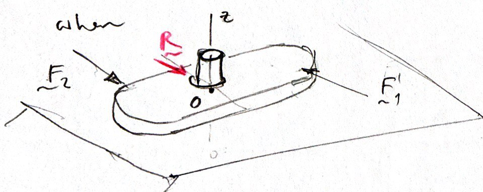

the force equilibrium ceases to be sufficient for motionlessness (the object rotates)

** Rigid Body
A body is said to be *rigid* when it is incapable of deforming.

[freehand depiction of a spinning top with a T-bar attached to the center of its basal face]

- what is a center of rotation?
- relative rotation of the T-bar about the longitudinal axis of the top

#+REVEAL: split
The motion portrayed by the top is considered as general spatial (3-D). The spatial motion of a rigid body can be resolved by 6 degrees-of-freedom (DOF).

In this course we consider mechanical systems that exhibit planar motion only!
- rotation about the plane normal (1 DOF)
- translations in plane (2 DOFs)
- the 6 DOFs of spatial motion are reduced to 3 DOFs in planar motion

#+REVEAL: split
#+ATTR_HTML: :width 900px
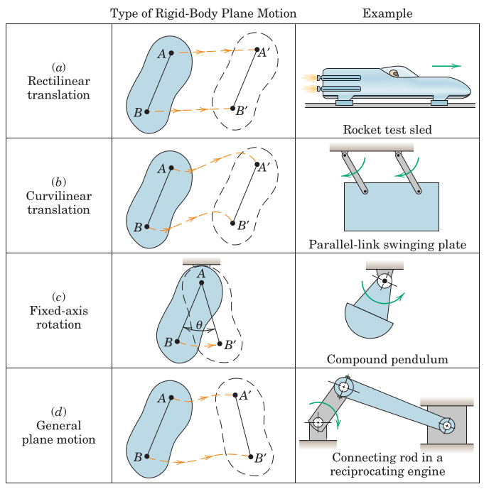

* Kinematic Relations
** Linear Kinematics
The relations between distance, velocity and acceleration along the translation path has already been covered: $s$ is the path variable, $v = \dot{s}$ is the velocity (tangent to the path), and $a_t = \dot{v} = \ddot{s}$ is the tangential acceleration. Remember the differential relation $a_t ds = v\,dv$.

** Angular Kinematics
The rotation is measured from any line segment relative to a fixed reference axis by the angle from the fixed axis to the line segment, $\theta$. 
#+ATTR_HTML: :width 400px
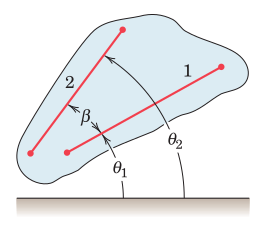

Note that, the rotations of two line segments may be measured as $\theta_1$ and $\theta_2$ which are related by a fixed angle $\beta$ (which shall never change during the process due to the rigid nature of the body).

Thus,
\begin{align}
 \theta_2 &= \theta_1 + \beta \\
 \dot{\theta}_2 &= \dot{\theta}_1 \\
 \ddot{\theta}_2 &= \ddot{\theta}_1
\end{align}

#+REVEAL: split
Furthermore, the relations between angle, angular velocity and angular acceleration can be defined as
\begin{align}
\omega &= \frac{d\theta}{dt} = \dot{\theta} \\
\alpha &= \frac{d\omega}{dt} = \dot{\omega} \\
\omega\, d\omega &= \alpha\, d\theta
\end{align}

#+REVEAL: split
The case of constant angular acceleration can be simply integrated as:
\begin{align}
\omega &= \omega_0 + \alpha t\\
\omega^2 &= \omega_0^2 + 2\alpha (\theta-\theta_0)\\
\theta &= \theta_0 + \omega t + \frac{1}{2} \alpha t^2
\end{align}

** Rotation about a Fixed Axis
#+ATTR_HTML: :width 500px
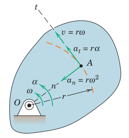

\begin{align}
 v &= r\omega \\
 a_n &= r\omega^2 = v^2/r \\
 a_t &= r\alpha
\end{align}

*** Rotation as a Vector Operation
When the plane of motion is identified with its normal $\boldsymbol{n}$ in a 3-D domain:
#+ATTR_HTML: :width 900px
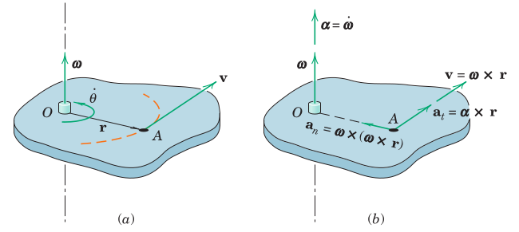

\begin{align}
 \boldsymbol{v} &= \omega \boldsymbol{n} \times \boldsymbol{r} \\
 \boldsymbol{\alpha}_n &= \omega \boldsymbol{n} \times \boldsymbol{v} \\
 \boldsymbol{\alpha}_t &= \alpha \boldsymbol{n} \times \boldsymbol{r}
\end{align}

** Examples
#+ATTR_HTML: :width 1600px
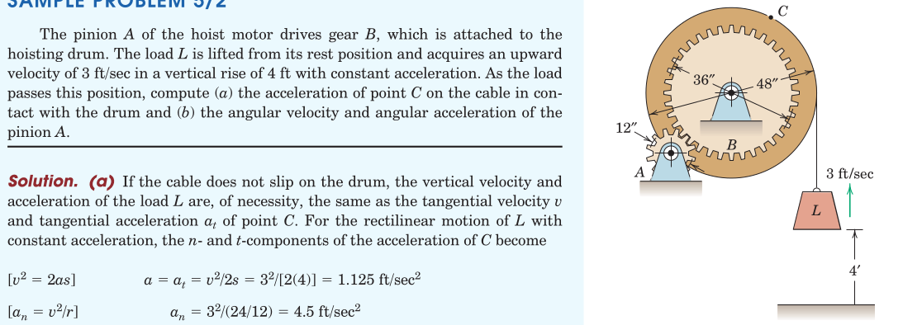

#+REVEAL: split
#+ATTR_HTML: :width 1600px
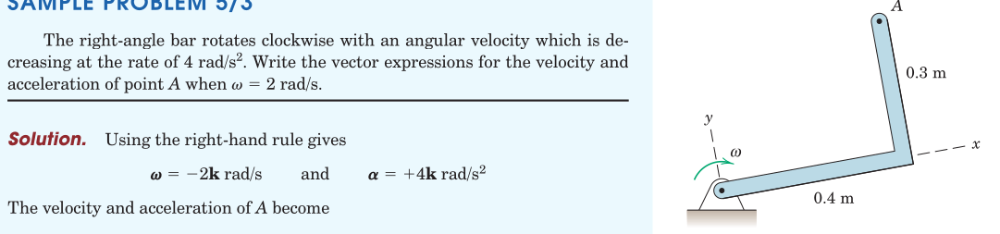

* Absolute Motion Formulation
In general there are two ways to deal with dynamics of rigid bodies
- Absolute Motion
- Relative Motion

In absolute motion formulation the *geometric relations* between problem variables are formed and then their *time derivatives* are taken.

If the geometric relations turn out to be overly complex than it may be preferable to turn to the relative formulation.

** Examples
#+ATTR_HTML: :width 1600px
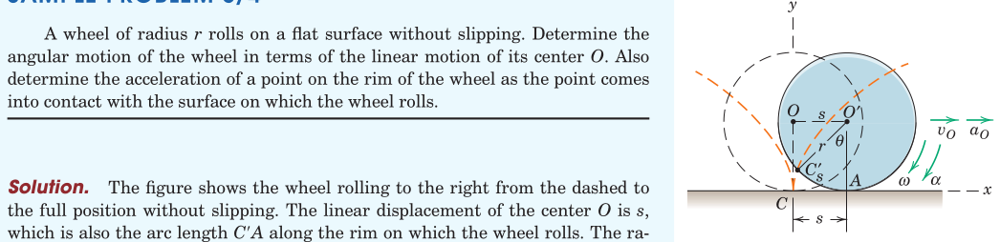

#+REVEAL: split
#+ATTR_HTML: :width 1600px
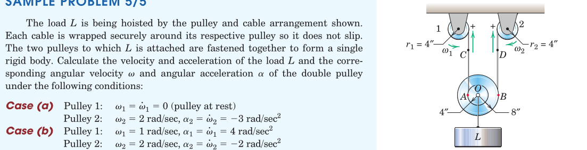

#+REVEAL: split
#+ATTR_HTML: :width 1600px
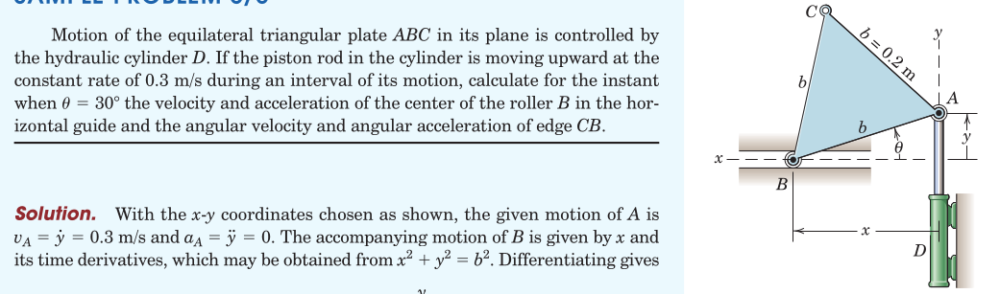

#+REVEAL: split
#+ATTR_HTML: :width 700px
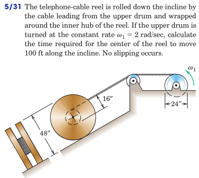

#+REVEAL: split
#+ATTR_HTML: :width 700px
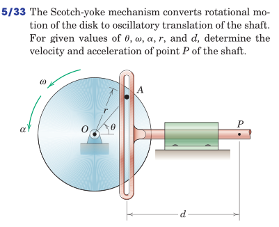

#+REVEAL: split
#+ATTR_HTML: :width 700px
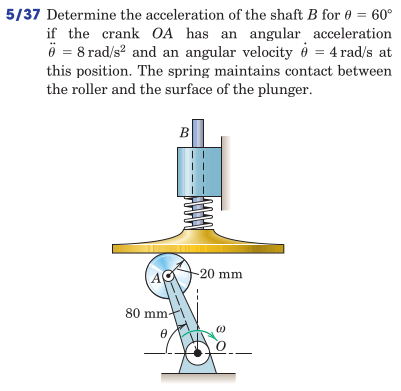

#+REVEAL: split
#+ATTR_HTML: :width 700px
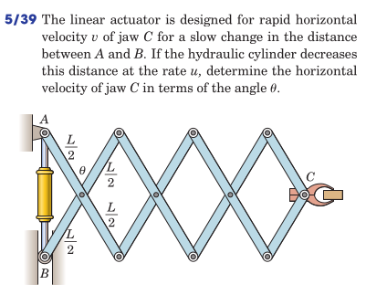

#+REVEAL: split
#+ATTR_HTML: :width 700px
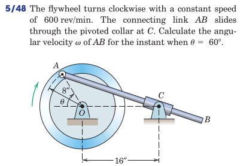

#+REVEAL: split
#+ATTR_HTML: :width 700px
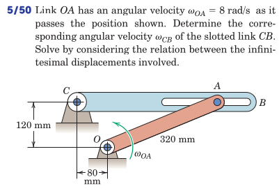

#+REVEAL: split
#+ATTR_HTML: :width 700px
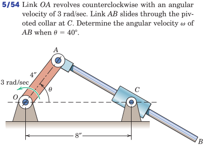

* Review
From Hibbeler, Engineering Mechanics: Dynamics: Chapter 15: 
