#+TITLE:  kinetics of bodies/relative velocity
#+AUTHOR: Fethi Okyar
#+DATE: 2025-11-30
#+SUBTITLE: Rigid-Body Kinematics
#+DESCRIPTION: 
#+STARTUP: overview
#+REVEAL_THEME: simple
#+REVEAL_INIT_OPTIONS: slideNumber:"c/t", width:1920, height:1080
#+REVEAL_TITLE_SLIDE: <h2>%t</h2> <h3>%s</h3> <h4>%d</h4>
#+OPTIONS: timestamp:nil toc:1 num:t
#+REVEAL_EXTRA_CSS: ../style.css
#+REVEAL_ROOT: https://cdn.jsdelivr.net/npm/reveal.js
#+HTML_HEAD_EXTRA: 

* Relative Velocity
** Between Two Point Masses
Remember the relative velocity expression for two point masses, each moving at its own with $\boldsymbol{v}^a$ and $\boldsymbol{v}^b$, separated by the position vector $\boldsymbol{r}^{b/a}$

[a freehand depiction of the operation stage]

Relative velocity signifies the difference between the velocities of the point masses
$\boldsymbol{v}^{b/a} = \boldsymbol{v}^b - \boldsymbol{v}^a$ which is sometimes just referred to as $\boldsymbol{v}^{rel}$.

*** Parallel and Perpendicular Components
The relative velocity between two point masses can be split into its components parallel to ($\parallel$) and perpendicular to ($\perp$) the axis that joins them. These can be written as $\boldsymbol{v}^{rel}_\parallel$ and $\boldsymbol{v}^{rel}_\perp$

Note that $\boldsymbol{v}^{rel}_\parallel$ indicates the increase/decrease of distance between the two points, while $\boldsymbol{v}^{rel}_\perp$ indicated the relative rotation of one point about the other, from which we can induce $\boldsymbol{v}^{rel}_\perp = \boldsymbol{\omega} \times \boldsymbol{r}$ to determine the angular velocity vector.

** Between Two Points of a Body
For two points on the same rigid body the expression of relative motion becomes slightly simplified as the distance between them never changes, in other words $\boldsymbol{v}^{rel}_\parallel=0$, *always*.

Thus, it is always true that
\[ \boldsymbol{v}^{rel} = \boldsymbol{v}^{rel}_\perp \]

[freehand depicting of observer sitting on the top of the body of an airliner at point $A$, and as the airlines goes through roll, yaw and pitch motions, other points around him seem to be rotating in certain directions but not moving away or towards him]

#+REVEAL: split
This means that it will always be true for two points on the same rigid body that their relative motion can be expressed in terms of pure rotation

\[ \boldsymbol{v}^b = \boldsymbol{v}^a  + \boldsymbol{\omega} \times \boldsymbol{r}^{b/a} \]

or inversely

\[ \boldsymbol{v}^a = \boldsymbol{v}^b  + \boldsymbol{\omega} \times \boldsymbol{r}^{a/b} \]

#+REVEAL: split
Problems expressed in terms of relative motion can be solved directly by using the vector equation, or in terms of its scalar components. In many cases, a graphical approach is also known to work (graphical velocity analysis)

** Examples
#+ATTR_HTML: :width 1600px
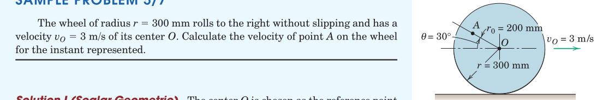

#+REVEAL: split
#+ATTR_HTML: :width 1600px
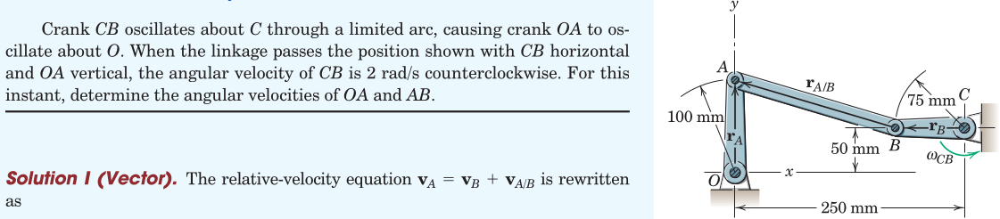

#+REVEAL: split
#+ATTR_HTML: :width 1600px
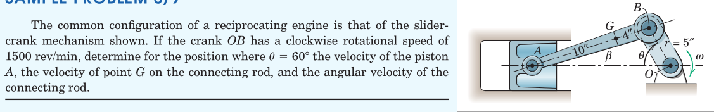

#+REVEAL: split
#+ATTR_HTML: :width 1600px
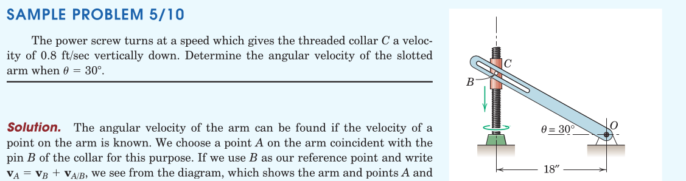

#+REVEAL: split
#+ATTR_HTML: :width 700px
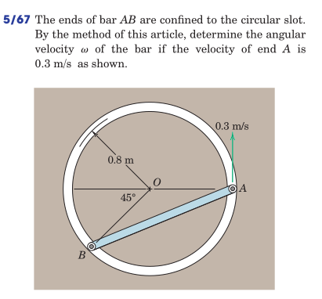

#+REVEAL: split
#+ATTR_HTML: :width 700px
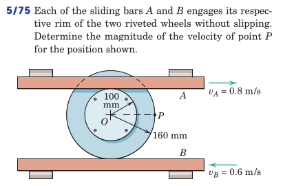

#+REVEAL: split
#+ATTR_HTML: :width 700px
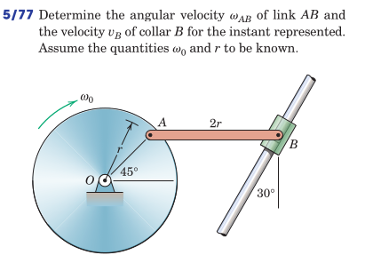

#+REVEAL: split
#+ATTR_HTML: :width 700px
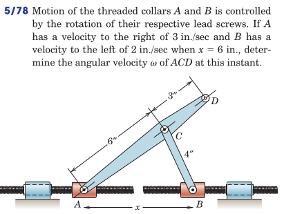

#+REVEAL: split
#+ATTR_HTML: :width 700px
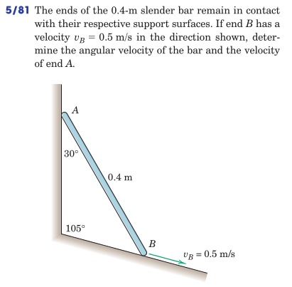

#+REVEAL: split
#+ATTR_HTML: :width 700px
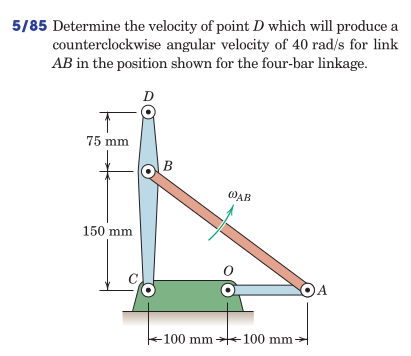

#+REVEAL: split
#+ATTR_HTML: :width 700px
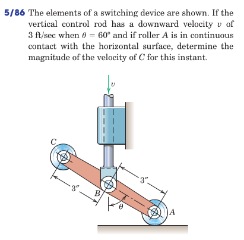

#+REVEAL: split
#+ATTR_HTML: :width 700px
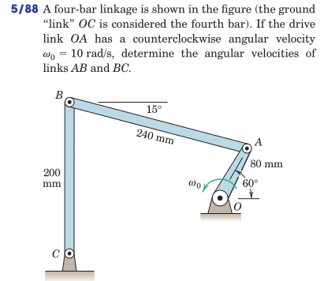
* Instantaneous Center of Rotation (ICR)
The velocities of two points $A$ and $B$ on a rigid body are related by
\[ \boldsymbol{v}^b = \boldsymbol{v}^a + \boldsymbol{v}^{b/a} \]
where $\boldsymbol{v}^{b/a} = \boldsymbol{\omega} \times \boldsymbol{r}^{b/a}$.

[freehand depiction of a body with two of its points labeled and their velocity arrows assigned. Location of the instantaneous centre $C$ is shown by intersecting lines perpendicular to velocities.]

The velocity of any point can be expressed with respect to the instantaneous centre as
\begin{align}
 \boldsymbol{v}^{a} &=  \boldsymbol{\omega} \times \boldsymbol{r}^{a/c} \\
 \boldsymbol{v}^{b} &=  \boldsymbol{\omega} \times \boldsymbol{r}^{b/c}
\end{align}

#+REVEAL: split
- The ICR may or may not be physically located on the body.
- The ICR is not necessarily a "fixed point" in space.

Examples:
- the case of a propeller
- the case of a link with parallel velocities

** The Centrodes Loci
- The path line traversed by a point $X$ forms a so called *locus* of that point.
- The locus of the ICR (point $C$ above) formed with respect to an inertial frame is known as the *space centrode*.
- The locus of the same point $C$ formed with respect to a frame attached to the body is known as the *body centrode*.

[ freehand depiction of the space and body centrodes of a rolling wheel ]

** Examples
#+ATTR_HTML: :width 1600px
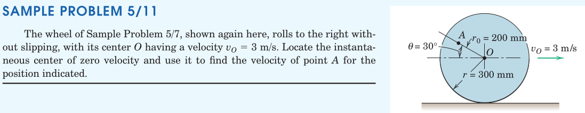

#+REVEAL: split
#+ATTR_HTML: :width 1600px
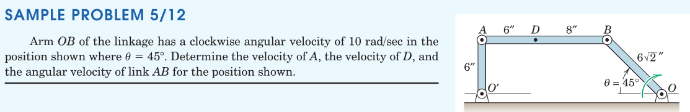

#+REVEAL: split
#+ATTR_HTML: :width 700px
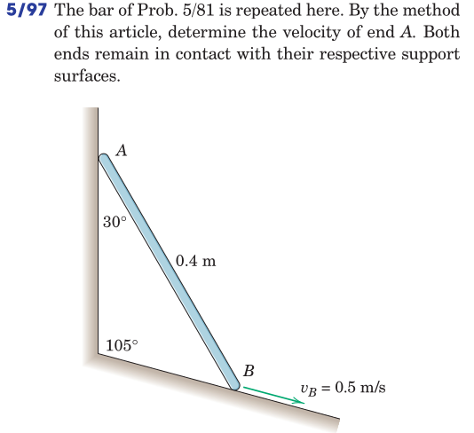

#+REVEAL: split
#+ATTR_HTML: :width 700px
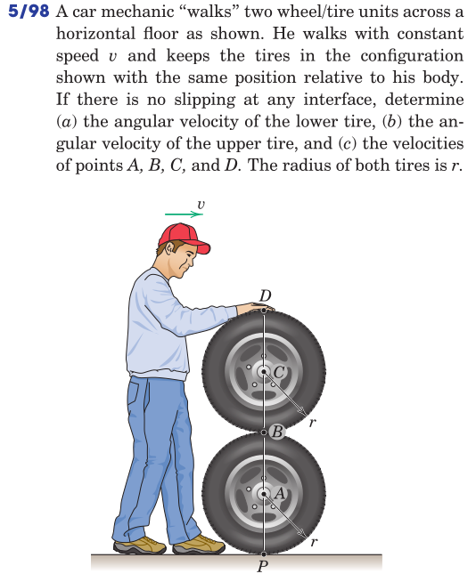

#+REVEAL: split
#+ATTR_HTML: :width 700px
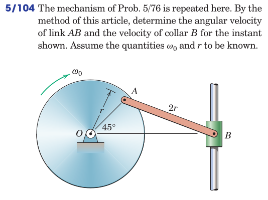

#+REVEAL: split
#+ATTR_HTML: :width 700px
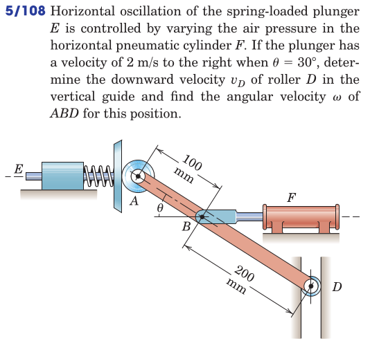

#+REVEAL: split
#+ATTR_HTML: :width 700px
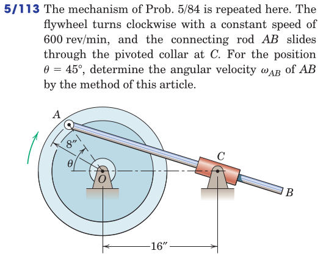

#+REVEAL: split
#+ATTR_HTML: :width 700px
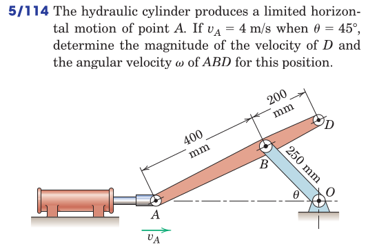

#+REVEAL: split
#+ATTR_HTML: :width 700px
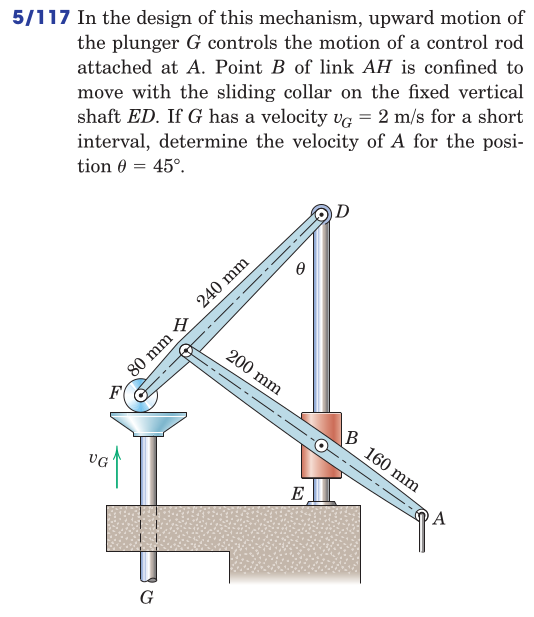
* Review
From Hibbeler, Engineering Mechanics: Dynamics: Chapter 16:
