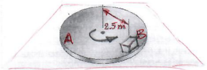
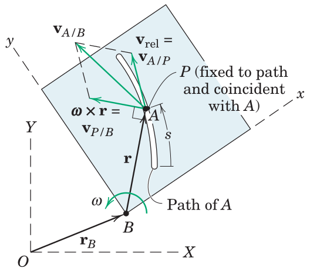

#+TITLE:  kinetics of bodies/relative acceleration
#+AUTHOR: Fethi Okyar
#+DATE: 2025-11-30
#+SUBTITLE: Rigid-Body Kinematics
#+DESCRIPTION: 
#+STARTUP: overview
#+REVEAL_THEME: simple
#+REVEAL_INIT_OPTIONS: slideNumber:"c/t", width:1920, height:1080
#+REVEAL_TITLE_SLIDE: <h2>%t</h2> <h3>%s</h3> <h4>%d</h4>
#+OPTIONS: timestamp:nil toc:1 num:t
#+REVEAL_EXTRA_CSS: ../style.css
#+REVEAL_ROOT: https://cdn.jsdelivr.net/npm/reveal.js
#+HTML_HEAD_EXTRA: 

* Relative Acceleration (on Inertial Frames)
** Derivative of Velocity
Starting with the relative velocity relation between two points $P$ and $Q$ on a rigid body
\[ \boldsymbol{v}^p = \boldsymbol{v}^q  + \boldsymbol{v}^{p/q} \]

we differentiate this with respect to time, giving
\[ \frac{d\boldsymbol{v}^p}{dt} = \frac{d\boldsymbol{v}^q}{dt}  + \frac{d\boldsymbol{v}^{p/q}}{dt} \]

where
\[ \boldsymbol{v}^{p/q} = \boldsymbol{\omega} \times \boldsymbol{r}^{p/q} \]

This is known as the "the relative acceleration relation".

*** the "dot" notation
In the dot notation the relative acceleration relation becomes
\[ \dot{\boldsymbol{v}}^p = \dot{\boldsymbol{v}}^q  + \dot{\boldsymbol{v}}^{p/q} \]

where time derivative of velocity is replaced with acceleration as
\[ \boldsymbol{a}^p = \boldsymbol{a}^q  + \dot{\boldsymbol{v}}^{p/q} \]

The time derivative of the relative velocity term is expanded
\[ \dot{\boldsymbol{v}}^{p/q} = \dot{\boldsymbol{\omega}} \times \boldsymbol{r}^{p/q} + \boldsymbol{\omega} \times \dot{\boldsymbol{r}}^{p/q} \]

but $\dot{\boldsymbol{r}}^{p/q} = \boldsymbol{v}^{p/q} = \boldsymbol{\omega} \times \boldsymbol{r}^{p/q}$, then

\[ \dot{\boldsymbol{v}}^{p/q} = \boldsymbol{\alpha} \times \boldsymbol{r}^{p/q} + \boldsymbol{\omega} \times \boldsymbol{\omega} \times \boldsymbol{r}^{p/q} \]

where $\boldsymbol{\alpha} = \dot{\boldsymbol{\omega}}$ represents the angular acceleration vector.

*** the relative acceleration relation (on inertial frames)
Substituting the derived terms we get
\[ \boldsymbol{a}^p = \boldsymbol{a}^q  + \boldsymbol{\alpha} \times \boldsymbol{r}^{p/q} + \boldsymbol{\omega} \times \boldsymbol{\omega} \times \boldsymbol{r}^{p/q} \]

This expression is slightly more complicated relative to it's velocity counterpart, but is managable (compared with the expression that will arise from using non-inertial frames).
** Examples
#+ATTR_HTML: :width 1600px
[[./meriam/prob_S5.13.png]]

#+REVEAL: split
#+ATTR_HTML: :width 1600px
[[./meriam/prob_S5.14.png]]

#+REVEAL: split
#+ATTR_HTML: :width 1600px
[[./meriam/prob_S5.15.png]]

#+REVEAL: split
#+ATTR_HTML: :width 700px
[[./meriam/prob_5.121.png]]

#+REVEAL: split
#+ATTR_HTML: :width 700px
[[./meriam/prob_5.127.png]]

#+REVEAL: split
#+ATTR_HTML: :width 700px
[[./meriam/prob_5.134.png]]

#+REVEAL: split
#+ATTR_HTML: :width 700px
[[./meriam/prob_5.137.png]]

#+REVEAL: split
#+ATTR_HTML: :width 700px
[[./meriam/prob_5.144.png]]

#+REVEAL: split
#+ATTR_HTML: :width 700px
[[./meriam/prob_5.147.png]]

#+REVEAL: split
#+ATTR_HTML: :width 700px
[[./meriam/prob_5.151.png]]

#+REVEAL: split
#+ATTR_HTML: :width 700px
[[./meriam/prob_5.153.png]]
* Relative Acceleration (on non-Inertial Frames)
When a coordinate measurement device (system) is mounted on a moving part (for example, a disk rotating about its centroid), it records motion relative to the disk.

#+ATTR_HTML: :width 600px

[freehand top view depiction of a cube sliding on the disk surface. Unit vectors $\boldsymbol{e}_1$ and $\boldsymbol{e}_2$ rotate with the disk. Points $B$ and $B'$ are instantaneously coincident, where $B$ is on the disk and $B'$ is on the block that starts sliding on the disk surface.]

How can the velocity of the block relative to the disk be expressed?
 
** Non-Inertial Frames
The use of rotating frames and rotating unit vectors greatly facilitate problems in which connecting pins slide in guide slots.

[freehand depiction of two bodies connected at a point via a pin sliding in a guide slot cut into one of the bodies. Two points $A$ and $P$ share a common location instantaneously. $A$ is on the pin, while $P$ is on the slot.]

The relative position vector from $P$ and $A$ can be expressed in both the non-inertial as well as the inertial frames as
\[ \bar{\boldsymbol{r}}^a - \bar{\boldsymbol{r}}^p = \bar{\boldsymbol{r}}^{a/p} = \boldsymbol{r}^{a/p} \]

where $\boldsymbol{r}^a = X^a \boldsymbol{i} + Y^a \boldsymbol{j}$ and $\bar{\boldsymbol{r}}^a = \bar{x}^a \boldsymbol{e}_1 + \bar{y}^a \boldsymbol{e}_2$

For the given instant $\boldsymbol{r}^{a} = \boldsymbol{r}^{p}$ which is equivalent to $\boldsymbol{r}^{a/p} \equiv \boldsymbol{r}^{rel} = \boldsymbol{0}$.

*** Motion of the Unit Vectors
Inspect the scene below by using unit vectors $\boldsymbol{i}$ and $\boldsymbol{j}$ attached to the inertial ($XY$) system, while unit vectors $\boldsymbol{e}_1$ and $\boldsymbol{e}_2$ rotate with the moving ($xy$) frame.

#+ATTR_HTML: :width 700px

Due to the frame rotation, the embedded unit vectors change orientation by differential amounts
\[ d\boldsymbol{e}_1 = d\theta \boldsymbol{e}_2,\hspace{1em} d\boldsymbol{e}_2 = -d\theta \boldsymbol{e}_1 \]

*** Inertial Position Vectors
Relative motion of points $A$ (attached to the pin moving in the slot) and $P$ (coincident point on the slot) will be studied. The locators of $P$ and $A$ in the inertial ($XY$) frame are
\begin{align}
 \boldsymbol{r}^a &= \boldsymbol{r}^b + \bar{\boldsymbol{r}}^a \\
 \boldsymbol{r}^p &= \boldsymbol{r}^b + \bar{\boldsymbol{r}}^p
\end{align}

where $\bar{\boldsymbol{r}}^\square = \bar{x}^\square \boldsymbol{e}_1 + \bar{y}^\square \boldsymbol{e}_2$ is a position vector relative to the moving (non-inertial) frame.

Note that, we can replace the $\square$ with any of the point labels, e.g. $a$ or $b$.

** Velocity Analysis
Here we study,
- derivative of the Position Vector to $P$, $\boldsymbol{r}^p$
- derivative of the Position Vector to $A$, $\boldsymbol{r}^a$

*** Derivative of the Position Vector to $P$
At $P$ the inertial velocity measurement reads
\[ \dot{\boldsymbol{r}}^p = \dot{\boldsymbol{r}}^b + \bar{x}^p \dot{\boldsymbol{e}}_1 + \bar{y}^p \dot{\boldsymbol{e}}_2 \]

Note that $\dot{\bar{x}}^p$ and $\dot{\bar{x}}^p$ are both zero as the point $P$ is fixed to the moving frame. The terms $\dot{\boldsymbol{e}}_1$ and $\dot{\boldsymbol{e}}_2$ can be found from the unit vector differentials stated previously, as
\[ \dot{\boldsymbol{e}_1} = \omega \boldsymbol{e}_2,\hspace{1em} \dot{\boldsymbol{e}_2} = -\omega \boldsymbol{e}_1 \]

The angular velocity of the body is $\boldsymbol{\omega} = \omega \boldsymbol{k}$ from which we induce the relations
\[ \dot{\boldsymbol{e}_1} = \boldsymbol{\omega} \times \boldsymbol{e}_1,\hspace{1em} \dot{\boldsymbol{e}_2} = \boldsymbol{\omega} \times \boldsymbol{e}_2 \]

by the use of which the inertial velocity of $P$ can be expressed as
\[ \dot{\boldsymbol{r}}^p = \dot{\boldsymbol{r}}^b + \boldsymbol{\omega} \times \bar{\boldsymbol{r}}^p \]

or equivalently as
\[ \boldsymbol{v}^p = \boldsymbol{v}^b + \boldsymbol{\omega} \times \bar{\boldsymbol{r}}^p \]

*** Derivative of the Position to $A$
At $A$ the inertial velocity measurement reads
\[ \dot{\boldsymbol{r}}^a = \dot{\boldsymbol{r}}^b + \dot{\bar{x}}^a \boldsymbol{e}_1 + \dot{\bar{y}}^a \boldsymbol{e}_2 + \bar{x}^a \dot{\boldsymbol{e}}_1 + \bar{y}^a \dot{\boldsymbol{e}}_2 \]

where the additional term $\dot{\bar{x}}^a \boldsymbol{e}_1 + \dot{\bar{y}}^a \boldsymbol{e}_2$ is identified as $\boldsymbol{v}^{a/p} \equiv \boldsymbol{v}^{rel}$.

Furthermore, with a similar derivation to that of $P$ we have
\[ \bar{x}^a \dot{\boldsymbol{e}}_1 + \bar{y}^a \dot{\boldsymbol{e}}_2 \equiv \boldsymbol{\omega} \times \bar{\boldsymbol{r}}^a \]

Finally, the inertial velocity of $A$ can be expressed as
\[ \dot{\boldsymbol{r}}^a = \dot{\boldsymbol{r}}^b + \boldsymbol{\omega} \times \bar{\boldsymbol{r}}^a + \boldsymbol{v}^{a/p} \]

or equivalently as
\[ \boldsymbol{v}^a = \boldsymbol{v}^b + \boldsymbol{\omega} \times \bar{\boldsymbol{r}}^p + \boldsymbol{v}^{a/p} \]

** The Total Differentiation of a Non-Inertial Vector 
It is observed from the above that a difference of ($\boldsymbol{\omega} \times \bar{\square}$) appears between the time derivatives taken with respect to a non-inertial and an inertial frame.

\[ \left(\frac{d\square}{dt}\right)_{XY} = \left(\frac{d\bar\square}{dt}\right)_{xy} + \boldsymbol{\omega} \times \bar\square \]

This law is used in taking the time derivative of velocity expressed in a non-inertial frame by replacing the $\square$ symbol with $\boldsymbol{v}$.

** Examples
#+ATTR_HTML: :width 1600px
[[./meriam/prob_S5.16.png]]

#+REVEAL: split
#+ATTR_HTML: :width 1600px
[[./meriam/prob_S5.17.png]]

#+REVEAL: split
#+ATTR_HTML: :width 700px
[[./meriam/prob_5.165.png]]

* Review
From Hibbeler, Engineering Mechanics: Dynamics: Chapter 16:
