#+TITLE:  kinetics of bodies/relative acceleration
#+AUTHOR: Fethi Okyar
#+DATE: 2025-11-30
#+SUBTITLE: Rigid-Body Kinematics
#+DESCRIPTION: 
#+STARTUP: overview
#+REVEAL_THEME: simple
#+REVEAL_INIT_OPTIONS: slideNumber:"c/t", width:1920, height:1080
#+REVEAL_TITLE_SLIDE: <h2>%t</h2> <h3>%s</h3> <h4>%d</h4>
#+OPTIONS: timestamp:nil toc:1 num:t
#+REVEAL_EXTRA_CSS: ../style.css
#+REVEAL_ROOT: https://cdn.jsdelivr.net/npm/reveal.js
#+HTML_HEAD_EXTRA: 

* Relative Acceleration (on Inertial Frames)
** Derivative of Velocity
Starting with the relative velocity relation between two points $P$ and $Q$ on a rigid body
\[ \boldsymbol{v}^p = \boldsymbol{v}^q  + \boldsymbol{v}^{p/q} \]

we differentiate this with respect to time, giving
\[ \frac{d\boldsymbol{v}^p}{dt} = \frac{d\boldsymbol{v}^q}{dt}  + \frac{d\boldsymbol{v}^{p/q}}{dt} \]

where
\[ \boldsymbol{v}^{p/q} = \boldsymbol{\omega} \times \boldsymbol{r}^{p/q} \]

This is known as the "the relative acceleration relation".

*** the "dot" notation
In the dot notation the relative acceleration relation becomes
\[ \dot{\boldsymbol{v}}^p = \dot{\boldsymbol{v}}^q  + \dot{\boldsymbol{v}}^{p/q} \]

where time derivative of velocity is replaced with acceleration as
\[ \boldsymbol{a}^p = \boldsymbol{a}^q  + \dot{\boldsymbol{v}}^{p/q} \]

The time derivative of the relative velocity term is expanded
\[ \dot{\boldsymbol{v}}^{p/q} = \dot{\boldsymbol{\omega}} \times \boldsymbol{r}^{p/q} + \boldsymbol{\omega} \times \dot{\boldsymbol{r}}^{p/q} \]

but $\dot{\boldsymbol{r}}^{p/q} = \boldsymbol{v}^{p/q} = \boldsymbol{\omega} \times \boldsymbol{r}^{p/q}$, then

\[ \dot{\boldsymbol{v}}^{p/q} = \boldsymbol{\alpha} \times \boldsymbol{r}^{p/q} + \boldsymbol{\omega} \times \boldsymbol{\omega} \times \boldsymbol{r}^{p/q} \]

where $\boldsymbol{\alpha} = \dot{\boldsymbol{\omega}}$ represents the angular acceleration vector.

*** the relative acceleration relation (on inertial frames)
Substituting the derived terms we get
\[ \boldsymbol{a}^p = \boldsymbol{a}^q  + \boldsymbol{\alpha} \times \boldsymbol{r}^{p/q} + \boldsymbol{\omega} \times \boldsymbol{\omega} \times \boldsymbol{r}^{p/q} \]

This expression is slightly more complicated relative to it's velocity counterpart, but is managable (compared with the expression that will arise from using non-inertial frames).
** Examples
#+ATTR_HTML: :width 1600px
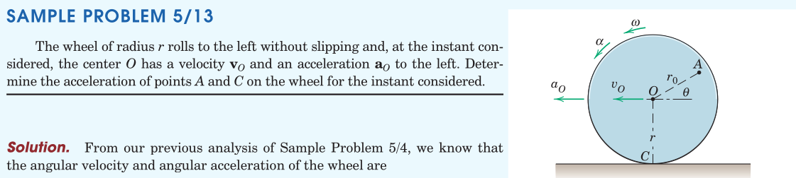

#+REVEAL: split
#+ATTR_HTML: :width 1600px
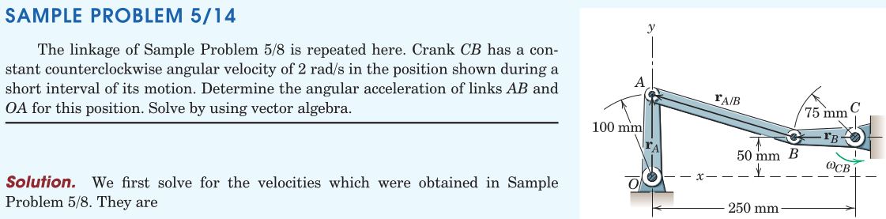

#+REVEAL: split
#+ATTR_HTML: :width 1600px
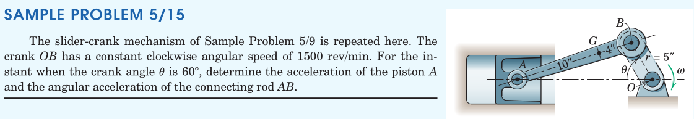

#+REVEAL: split
#+ATTR_HTML: :width 700px
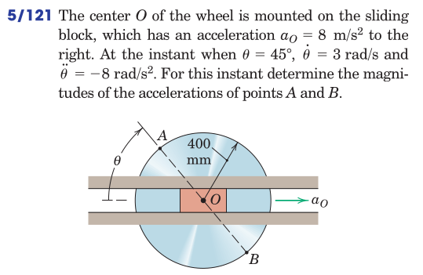

#+REVEAL: split
#+ATTR_HTML: :width 700px
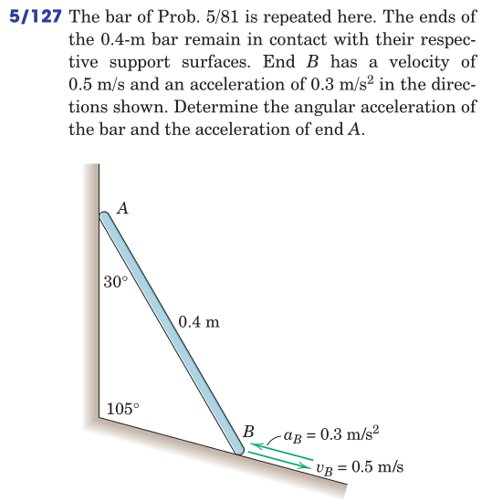

#+REVEAL: split
#+ATTR_HTML: :width 700px
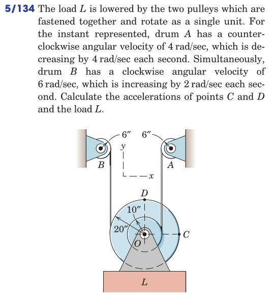

#+REVEAL: split
#+ATTR_HTML: :width 700px
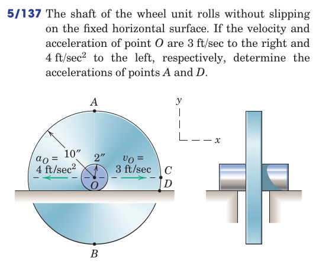

#+REVEAL: split
#+ATTR_HTML: :width 700px
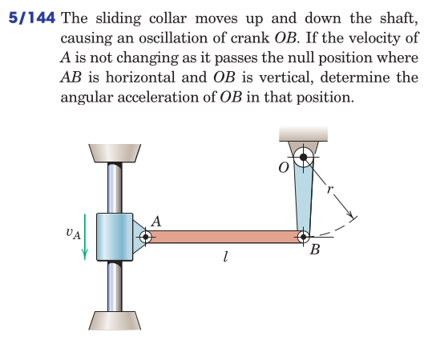

#+REVEAL: split
#+ATTR_HTML: :width 700px
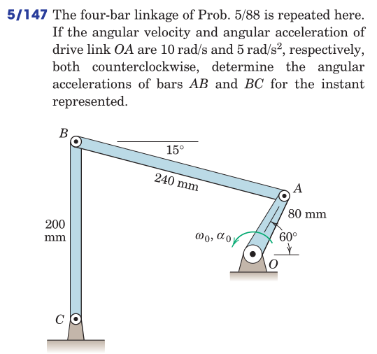

#+REVEAL: split
#+ATTR_HTML: :width 700px
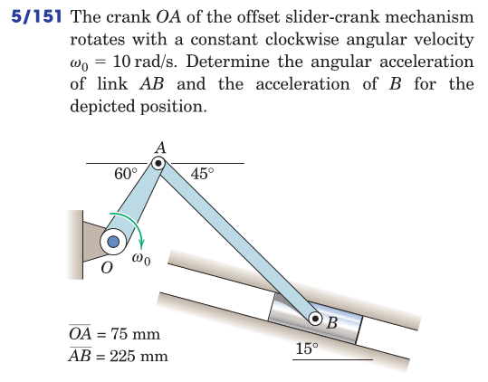

#+REVEAL: split
#+ATTR_HTML: :width 700px
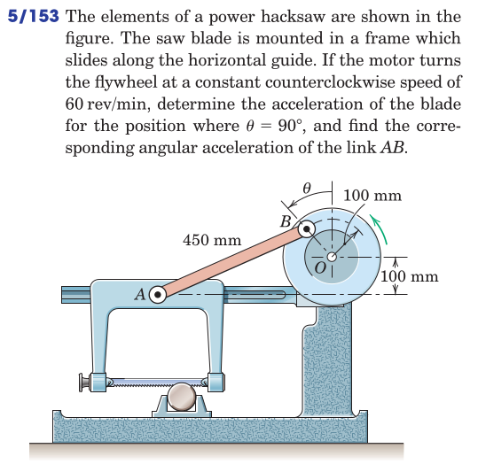
* Relative Acceleration (on non-Inertial Frames)

** Examples
#+ATTR_HTML: :width 1600px
[[./meriam/prob_S5.16.png]]

#+REVEAL: split
#+ATTR_HTML: :width 1600px
[[./meriam/prob_S5.17.png]]

#+REVEAL: split
#+ATTR_HTML: :width 700px
[[./meriam/prob_5.165.png]]

* Review
From Hibbeler, Engineering Mechanics: Dynamics: Chapter 16:
