#+TITLE:  kinetics/general equations and translation
#+AUTHOR: Fethi Okyar
#+DATE: 2025-12-09
#+SUBTITLE: Rigid Bodies
#+DESCRIPTION: 
#+STARTUP: overview
#+REVEAL_THEME: simple
#+REVEAL_INIT_OPTIONS: slideNumber:"c/t", width:1920, height:1080
#+REVEAL_TITLE_SLIDE: <h2>%t</h2> <h3>%s</h3> <h4>%d</h4>
#+OPTIONS: timestamp:nil toc:1 num:t
#+REVEAL_EXTRA_CSS: ../style.css
#+REVEAL_ROOT: https://cdn.jsdelivr.net/npm/reveal.js
#+HTML_HEAD_EXTRA: 

* Euler's Equations of Motion
** Motivation
[freehand depiction of a body in planar motion, (a) it's degrees-of-freedom, (b) the acceleration diagram]

Two translational (in-plane force) and one rotational (out-of-plane moment) equation

Note the mass moment of inertia that appears due to the rate of change of moment of momentum term

*** Force Reduction and Kinetic Diagram
#+ATTR_HTML: :width 700px
[[./meriam/figure_6.1.png]]

** Plane Motion Equations
#+ATTR_HTML: :width 500px
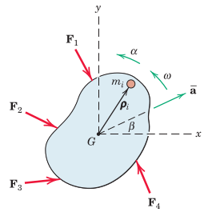

The conversion from summation to integral forms is revisited.

After taking the cross product in the moment of momentum, the scalar expression of the sole out-of-plane component is used.

The three equations in plane are written about the centre of mass, $G$

*** Kinetic Diagram in Plane
#+ATTR_HTML: :width 700px
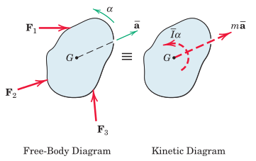

The equivalence between the external loads and the kinetic diagram is noted.

** Alternative Moment Expressions
We look at points for writing equations of motion other than $G$.

#+ATTR_HTML: :width 700px
[[./meriam/figure_6.5.png]]

For example a moving point $P$ can become handy in certain situations.

The balance of moment of momentum expression about $P$ (in both vector as well as scalar forms are provided).

*** An Equivalent of the Balance of MoM at $P$
An alternative expression of the balance of moment of momentum about $P$ is provided.

The proof is omitted.

Using the rate of change of the moment of momentum about $P$, the mass moment of inertia is evaluated at $P$, instead of $G$.

*** Equations of Motion at a Stationary Point $O$
For this, we can use the expression obtained at $P$ for $O$, but the point $O$ has no acceleration.

The modified equation of motion is provided.

Mass moment of inertia is the *key* to solving equations of motion of rigid bodies

* Mass Moment of Inertia
For a rigid body the mass moment of inertia represents the proximity of mass distribution about a given axis, e.g. axis $O-O$.

#+ATTR_HTML: :width 400px
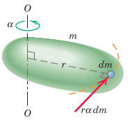

The general expression of the mass moment of inertia is provided. Relation $dm = \rho dv$ is noted.

The mass moment of inertia is a property related with the selected axis of rotation.

#+REVEAL: split
Example 1: Evaluation of the mass moment of inertia of a circular cylinder about its longitudinal axis.

#+REVEAL: split
Example 2: The mass moment of inertias of a rectangular prism are provided about its three principal axes.

** Principal Axis
Distinct volumetric geometries are usually associated with characteristic axes.

For example:
- a slender bar
- a flat disk
- a rectangular prism

all have easily identifiable principle axes.

The principal axes are always centroidal and the planes of symmetry of the object can be used to identify them.

Mass moment of inertia of well known objects are provided in Appendices of engineering mechanics textbooks.

#+REVEAL: split
#+ATTR_HTML: :width 1600px
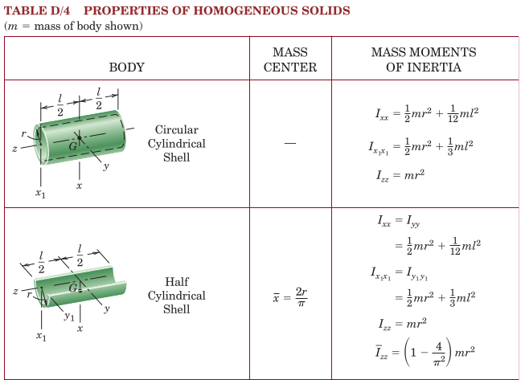

** Parallel-Axis Theorem
#+ATTR_HTML: :width 500px
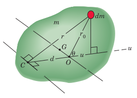

Given the centroidal mass moment of inertias, $\bar{I}_{xx}$, etc., the mass moment of inertia can be evaluated about other parallel axes obtained by shifting the original axis by a given amount $d$. 

A simple formula for shifting is provided.

** Raduis of Gyration, $k$
This is another physical concept used to measure the proximity of the mass distribution to a given axis. It is similar and alternative to the concept of mass moment of inertia.

The relation between $k$ and $I$ are provided.

* Analysis Procedure
The analysis procedure can be divided into three phases
- *Kinematics:* in this phase we look at whether the system consists of constrained or unconstrained bodies. Constrained bodied involve relations between their kinematic variables which need to be expressed.
- *Diagrams:* We first select the part(s) or group of parts that will be used to produce equations of motion
  + Free-body diagram(s)
  + Force/couple reduction diagram(s): for this we need to decide the location at which the equation of motion will be expressed
  + Kinetic diagram(s)
- *Equations of motion:*
  + Write equations of motion for each diagram group
  + Calculate the mass moment of inertias of the bodies thru the relevant axes
  + Use these equations to solve for the unknowns

* Translation
The type of dynamics of a moving system can be considered under three items
- Translation (rectilinear/curvilinear)
- Pure rotation
- General plane motion

#+REVEAL: split
In translation we have the picture
#+ATTR_HTML: :width 700px
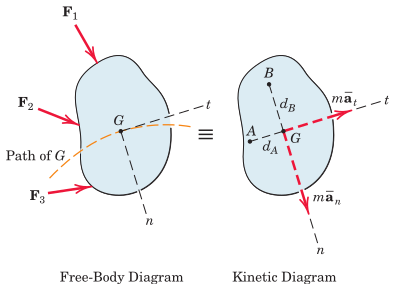

Note that the number of equations to be used in the solution are
- two equations of motion (translational)
- one equation of equilibrium (rotational)

* Examples
#+ATTR_HTML: :width 1600px
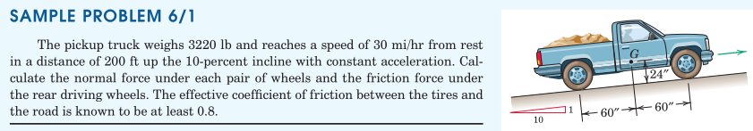

#+REVEAL: split
#+ATTR_HTML: :width 1600px
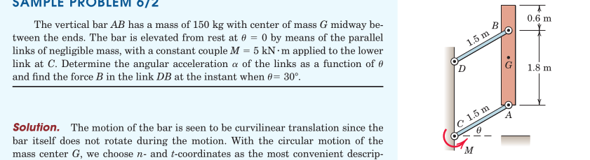

#+REVEAL: split
#+ATTR_HTML: :width 700px
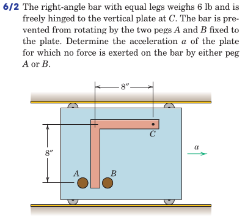

#+REVEAL: split
#+ATTR_HTML: :width 700px
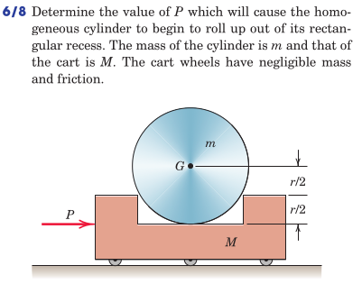

#+REVEAL: split
#+ATTR_HTML: :width 700px
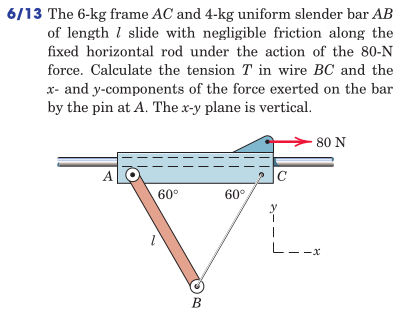

#+REVEAL: split
#+ATTR_HTML: :width 700px
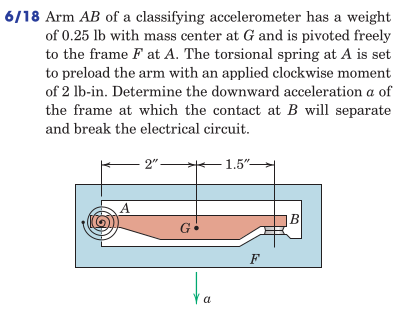

#+REVEAL: split
#+ATTR_HTML: :width 700px
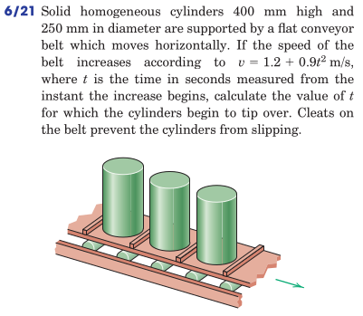

#+REVEAL: split
#+ATTR_HTML: :width 700px
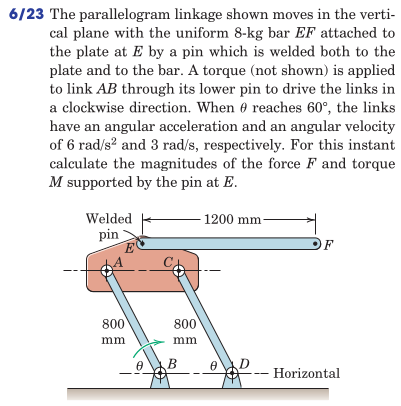

#+REVEAL: split
#+ATTR_HTML: :width 700px
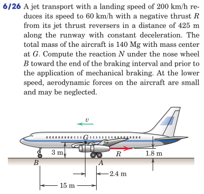

* Review

