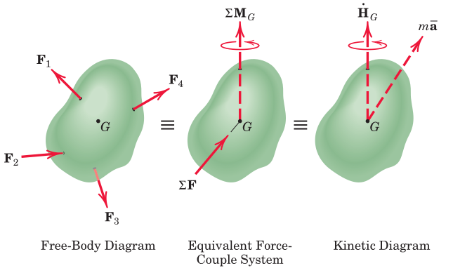
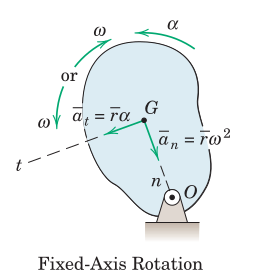
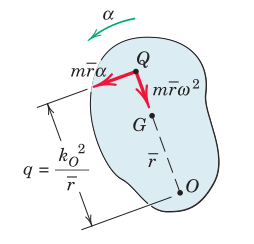
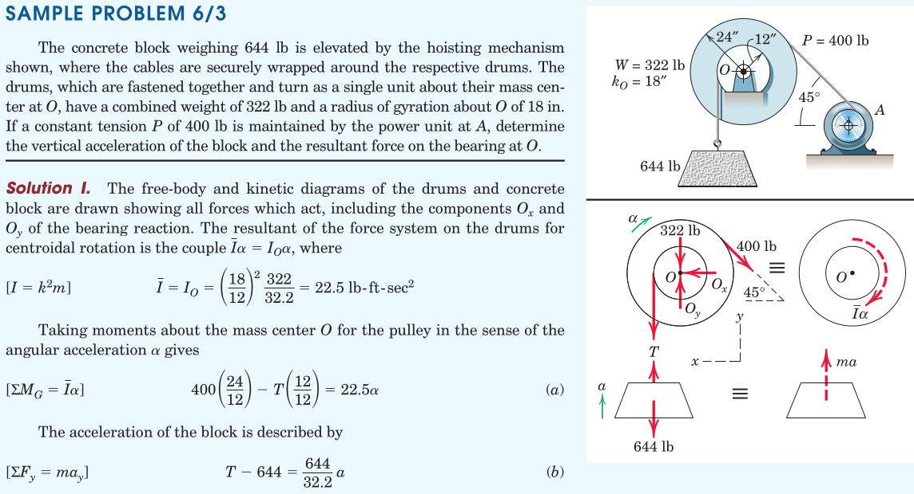
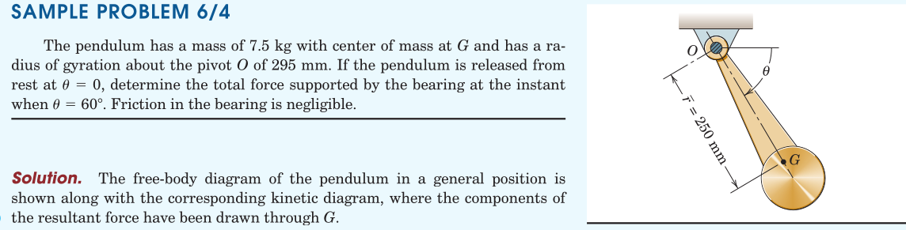
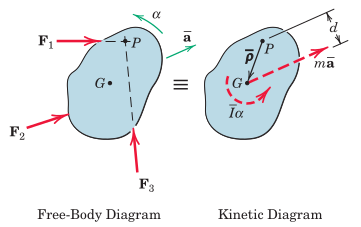
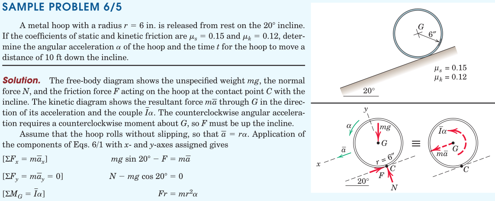
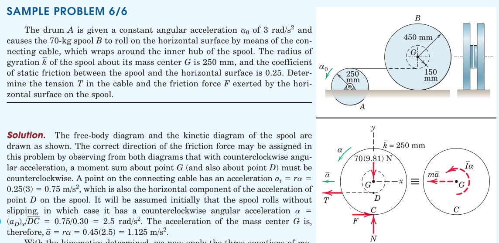
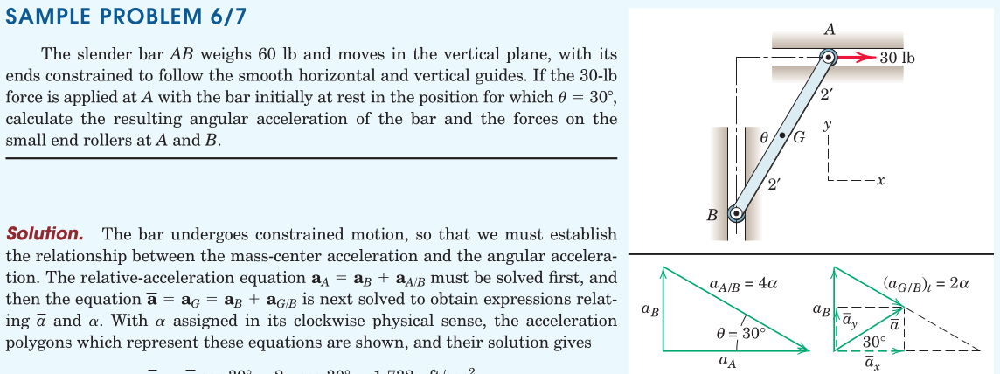
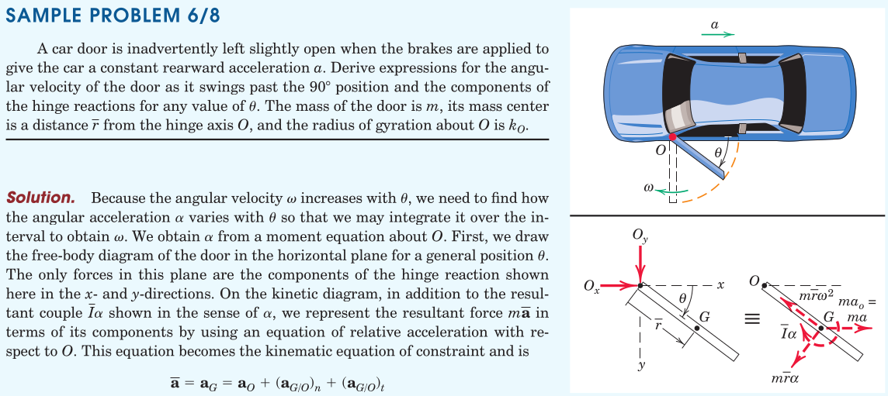

#+TITLE:  kinetics/general plane motion
#+AUTHOR: Fethi Okyar
#+DATE: 2025-12-17
#+SUBTITLE: Rigid Bodies
#+DESCRIPTION: 
#+STARTUP: overview
#+REVEAL_THEME: simple
#+REVEAL_INIT_OPTIONS: slideNumber:"c/t", width:1920, height:1080
#+REVEAL_TITLE_SLIDE: <h2>%t</h2> <h3>%s</h3> <h4>%d</h4>
#+OPTIONS: timestamp:nil toc:1 num:t
#+REVEAL_EXTRA_CSS: ../style.css
#+REVEAL_ROOT: https://cdn.jsdelivr.net/npm/reveal.js
#+HTML_HEAD_EXTRA: 

* Euler's Equations of Motion
Two translational (in-plane force) and one rotational (out-of-plane moment) equation

Note the mass moment of inertia that appears due to the rate of change of moment of momentum term

Force Reduction and Kinetic Diagram
#+ATTR_HTML: :width 700px

* Rotation about a Fixed-Axis
#+ATTR_HTML: :width 400px

[freehand depiction of the free-body and kinetic diagrams]

Equations of motion will be stated by writing the balance of momentum at the center of mass, and the balance of moment of momentum at point of convenience.

** At the Center of Mass, $G$
\[ \sum M^G = \bar{I} \alpha \]

** About the Fixed Axis, $O$
\[ \sum M^O = I^O \alpha \]

Notes:
1. the derivation of this formula by carrying the kinetic resultants to point O on the left-hand side and by evaluating the expression for $I^O$ using the parallel-axis theorem on the right-hand side.

** About the Center of Percussion, $Q$
#+ATTR_HTML: :width 400px

We may carry the kinetic resultants on the line $OG$ to find a location $Q$ with zero net kinetic moment, satisfying $m \bar{r} \alpha q = \bar{I} \alpha + m \bar{r} \alpha (\bar{r})$.

This location is called a /center of percussion/. It follows that the sum of the moments of all external forces about this point is always zero, i.e. $\sum M^Q = 0$.

Using the parallel-axis theorem and $I^O = (k^O)^2$ yields $q = (k^O)^2/\bar{r}$.

** Examples
#+ATTR_HTML: :width 1600px

#+REVEAL: split
#+ATTR_HTML: :width 1600px

#+REVEAL: split
#+ATTR_HTML: :width 700px
[[./meriam/prob_6.X.png]]

* General Plane Motion
The equations of general plane motion are found in the same way as in the prior section. However, there is no stationary point in this case.

The selection of the location to write the moment equation requires attention. Viable alternative locations are:
1. The center of mass, $G$
2. Arbirtraty point, $P$

#+REVEAL: split
For example, the intersection point $P$ of two external forces may prove to facilitate the solution process. 
#+ATTR_HTML: :width 700px

In this case the moment equation can be written as $\sum M^P = \bar{I}\alpha + m \bar{a}d$.

If the accelaration at $P$ is known then it may even be more convenient to use the alternate form $\sum \boldsymbol{M}^P = I^P \boldsymbol{\alpha} + \bar{\boldsymbol{\rho}} \times m \boldsymbol{a}^P$. 

#+REVEAL: split
Some other points that need attention will be
1. Constrained versus Unconstrained Motion
2. Number of Unknowns
3. Identification of the Body or System
4. Kinematics
5. Consistency of Motion Assumption between Free-Bodies

** Examples
#+ATTR_HTML: :width 1600px

#+REVEAL: split
#+ATTR_HTML: :width 1600px

#+REVEAL: split
#+ATTR_HTML: :width 1600px

#+REVEAL: split
#+ATTR_HTML: :width 1600px

#+REVEAL: split
#+ATTR_HTML: :width 700px
[[./meriam/prob_6.X.png]]

* Review

