#+TITLE:  kinetics/work-energy relations
#+AUTHOR: Fethi Okyar
#+DATE: 2025-12-18
#+SUBTITLE: Rigid Bodies
#+DESCRIPTION: 
#+STARTUP: overview
#+REVEAL_THEME: simple
#+REVEAL_INIT_OPTIONS: slideNumber:"c/t", width:1920, height:1080
#+REVEAL_TITLE_SLIDE: <h2>%t</h2> <h3>%s</h3> <h4>%d</h4>
#+OPTIONS: timestamp:nil toc:1 num:t
#+REVEAL_EXTRA_CSS: ../style.css
#+REVEAL_ROOT: https://cdn.jsdelivr.net/npm/reveal.js
#+HTML_HEAD_EXTRA: 

* Motivation
- For mass points we visited work-energy relations which was seen to be useful in describing motion that resulted from the cumulative effect of forces acting through distances traveled over the path trajectory.
- When the forces were conservative (non-dissipative), we were able to determine velocity changes by analyzing the energy conditions at the beginning and end states of the motion interval, without  determining accelerations.
- Here we extend this principle to rigid bodies.

* Work of Forces and Couples
The work done by a force $\boldsymbol{F}$ is
\[ U = \int\boldsymbol{F} \cdot d\boldsymbol{r} \hspace{1.5em} \mathrm{or} \hspace{1.5em} U = \int (F \cos \alpha) ds \]

#+REVEAL: split
#+ATTR_HTML: :width 500px
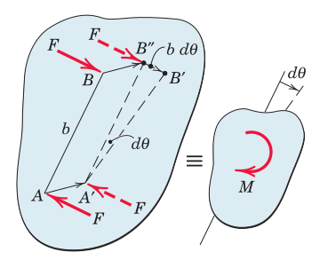

The work done by a couple produces $dU = F (b\,d\theta) = M\,d\theta$ due to the rotational part of the motion, which gives
\[ U = \int M\, d\theta \]
in a finite rotation.

* Kinetic Energy
For rigid bodies in
- translation
- fixed-axis rotation
- general plane motion

** Translation
#+ATTR_HTML: :width 500px
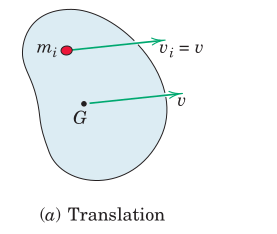

From the particle $T_i = \frac{1}{2} m_i v^2$ to the entire body $T = \lim \sum \frac{1}{2} m_i v^2 = \frac{1}{2} \int_B v^2 dm$ giving
\[ T = \frac{1}{2} mv^2 \]

** Fixed-axis rotation
#+ATTR_HTML: :width 500px
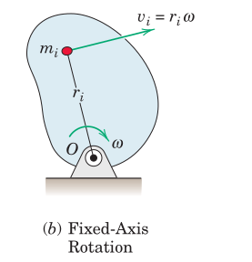

For the particle rotating with angular speed $\omega$ about point $O$, $T_i = \frac{1}{2} m_i (r_i\omega)^2$ extending to the entire body as $T = \frac{1}{2} \omega^2 \lim \sum  m_i r_i^2 = \frac{1}{2} \omega^2 \int_B r^2 dm$ where $\int_B r^2 dm \equiv I^O$ so that
\[ T = \frac{1}{2} I^O \omega^2 \]

** General plane motion
#+ATTR_HTML: :width 500px
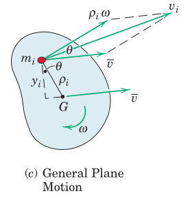

The velocity $v_i$ of $m_i$ may be expressed in terms of the velocity of the mass center $\bar{v}$ and the velocity $\rho_i\omega$ relative to the mass center. With the aid of the cosine rule for adding vector components the kinetic energy for the particle can be written as
\[ T = \lim \sum \frac{1}{2} m_i (\bar{v}^2 + \rho_i^2 \omega^2 + 2 \bar{v} \rho_i \omega \cos \theta) \]

#+REVEAL: split
#+ATTR_HTML: :width 500px

Factoring out $\bar{v}$ and $\omega$ out of the summation the last term becomes
\[ \omega \bar{v} \lim \sum m_i \rho_i \cos \theta = \omega \bar{v} \int_B y\, dm = 0 \]
due to the integral being taken about the center of mass and the kinetic energy is obtained as
\[T = \frac{1}{2} m \bar{v} + \frac{1}{2} \bar{I} \omega^2 \]

*** Alternative expression
Kinetic energy of a rigid body in plane motion can also be conveniently expressed about the instantaneous center $C$ of velocity as
\[ T = \frac{1}{2} I^C \omega^2 \]

* Potential Energy
The work-energy relation was introduced as
\[ T_1 + U_{1-2} = T_2 \]
applies to any mechanical system including rigid bodies.

If the effect of gravity and springs are expressed by means of potential energy rather than work, then the above equation may be rewritten as
\[ T_1 + V_1 + U'_{1-2} = T_2 + V_2 \]
where $U'$ denotes the work by all /active forces/ other than gravity and spring forces.

A free-body diagram or an active-force diagram should be used in either case.

The work-energy method is most useful for analyzing conservative force systems that do not involve dissipative forces such as friction.

* Power
For a force $\boldsymbol{F}$ acting on a rigid body in plane motion, the power developed by that force at a given instant is calculated as the rate at which the force is doing work
\[ P = \frac{dU}{dt} = \frac{\boldsymbol{F} \cdot d\boldsymbol{r}}{dt} = \boldsymbol{F} \cdot \boldsymbol{v} \]

Similarly, for a couple $M$ acting on the body, the power developed by the couple at a given instant is the rate at which it is doing work
\[ P = \frac{dU}{dt} = \frac{M\,d\theta}{dt} = M\omega\]

If the force and couple act simultaneously, the total instantaneous power is
\[ P = \boldsymbol{F} \cdot \boldsymbol{v} + M\omega \]

#+REVEAL: split
For an infinitesimal displacement the work-energy expression becomes
\[ dU' = dT + dV \]

Dividing by dt the total power of active forces and couples are
\[ P = \frac{dU'}{dt} = \dot{T} + \dot{V} = \frac{d}{dt} (T+V) \]

Note that the first term may be written as
\begin{align}
\dot{T} &= \frac{d}{dt} \left( \frac{1}{2} m \bar{\boldsymbol{v}} \cdot \bar{\boldsymbol{v}} + \frac{1}{2} M \omega \right) \\
 &= \frac{1}{2} m (\bar{\boldsymbol{a}} \cdot \bar{\boldsymbol{v}} + \bar{\boldsymbol{v}} \cdot \bar{\boldsymbol{a}} ) + \bar{I} \omega \dot{\omega} \\
 &= m \bar{\boldsymbol{a}} \cdot \bar{\boldsymbol{v}} + (\bar{I}\alpha)\omega = \boldsymbol{R}\cdot \bar{\boldsymbol{v}} + \bar{M}\omega
\end{align}
where $\boldsymbol{R}$ is the resultant of /all/ forces acting on the body and $\bar{M}$ is the resultant moment about the mass center $G$ of /all/ forces.

* Examples
#+ATTR_HTML: :width 1600px
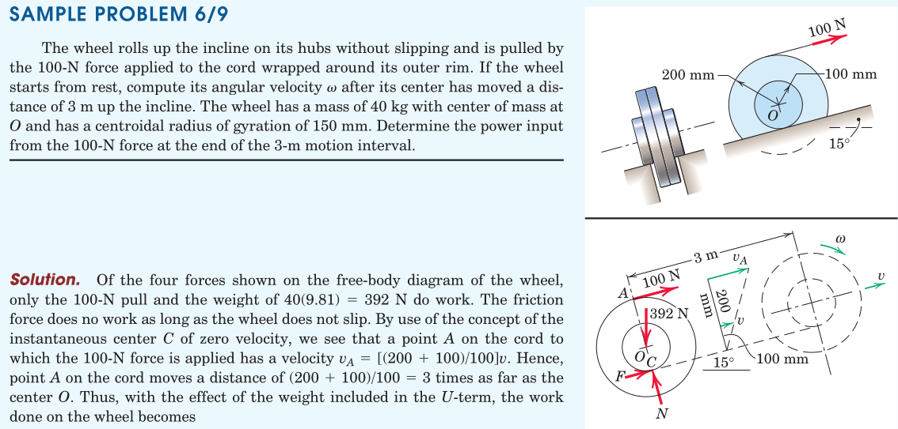

#+REVEAL: split
#+ATTR_HTML: :width 1600px
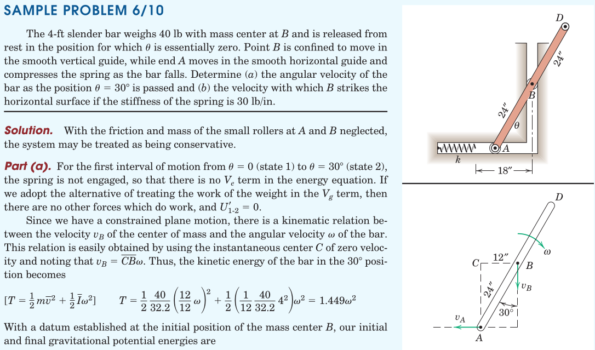

#+REVEAL: split
#+ATTR_HTML: :width 1600px
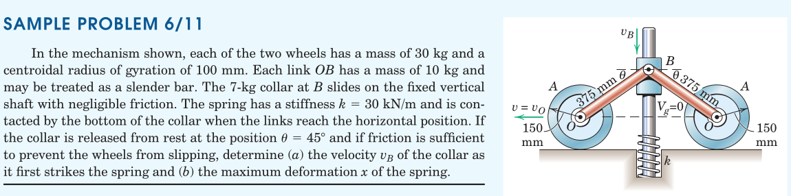

#+REVEAL: split
#+ATTR_HTML: :width 700px
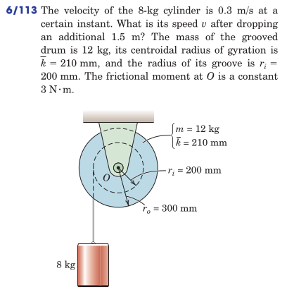

#+REVEAL: split
#+ATTR_HTML: :width 700px
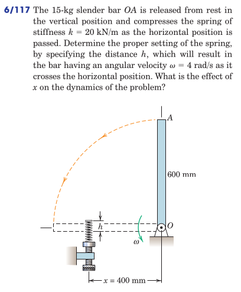

#+REVEAL: split
#+ATTR_HTML: :width 700px
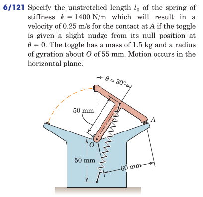

#+REVEAL: split
#+ATTR_HTML: :width 700px
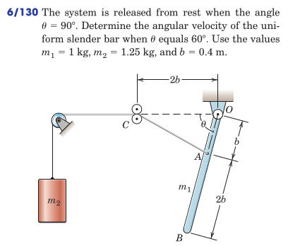

#+REVEAL: split
#+ATTR_HTML: :width 700px
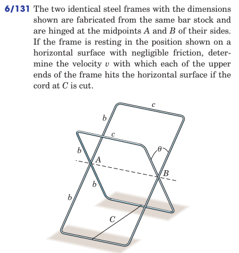

#+REVEAL: split
#+ATTR_HTML: :width 700px
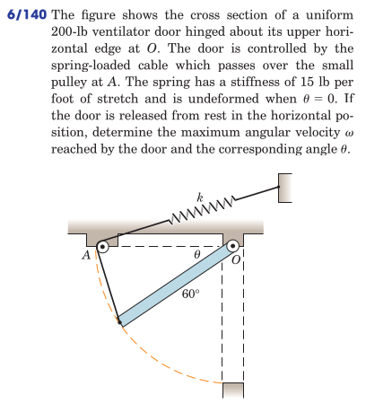
