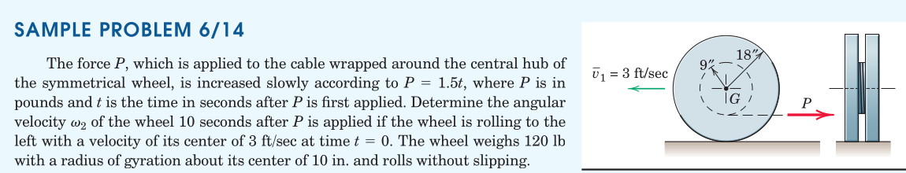
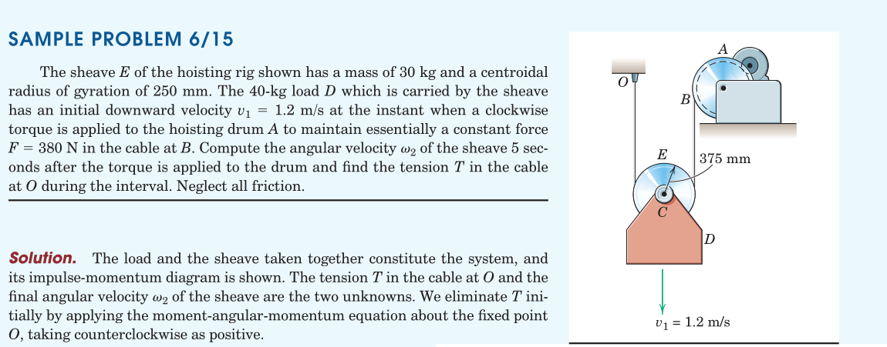
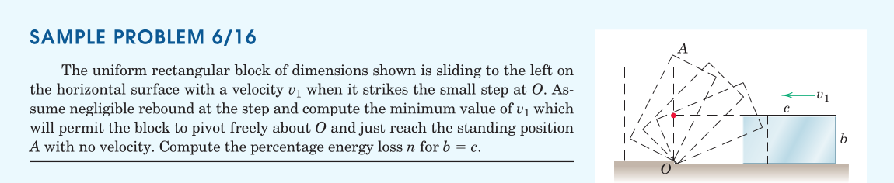

#+TITLE:  kinetics/impulse-momentum relations
#+AUTHOR: Fethi Okyar
#+DATE: 2025-12-24
#+SUBTITLE: Rigid Bodies
#+DESCRIPTION: 
#+STARTUP: overview
#+REVEAL_THEME: simple
#+REVEAL_INIT_OPTIONS: slideNumber:"c/t", width:1920, height:1080
#+REVEAL_TITLE_SLIDE: <h2>%t</h2> <h3>%s</h3> <h4>%d</h4>
#+OPTIONS: timestamp:nil toc:1 num:t
#+REVEAL_EXTRA_CSS: ../style.css
#+REVEAL_ROOT: https://cdn.jsdelivr.net/npm/reveal.js
#+HTML_HEAD_EXTRA: 

* Impulse-Momentum Equations
Q: Remember the impulse momentum equations for particles?

Integrating the balance of momentum principle in time we get this.

[free-hand depiction of a rigid body, showing a differential mass element with its velocity]

For a rigid body, integrate the product of velocity and body mass element to find the linear momentum of a rigid body
\[ \boldsymbol{G} = m \bar{\boldsymbol{v}} \]

** Balance of Momentum in Plane Motion
The vector equation of the balance of linear momentum yields two equations in plane
\begin{align}
\sum_i F_{xi} &= \dot{G}_x \\
\sum_i F_{yi} &= \dot{G}_y
\end{align}

which can be integrated to yield
\begin{align}
(G_x)_1 + \int_1^2 \sum_i F_{xi} dt &= (G_x)_2 \\
(G_y)_1 + \int_1^2 \sum_i F_{yi} dt &= (G_y)_2
\end{align}

*** Notes
1. In work-energy relations only the active forces do work (reactive forces have no contribution to work)
2. Conversely, in impulse-momentum equations all external forces contribute to the impulse.

** Moment of Momentum
[free-hand depiction of a rigid body in general motion showing a mass element with its velocity related to the angular velocity]

The sum of moments of linear momenta of all mass contributions about the mass center will become an integral in the limit as the mass elements are made small.

Using the relation of velocity of a rigid body particle relative to it's center of mass, we obtain $\boldsymbol{H}^G$.

This can be turned into a scalar equation based on the knowledge that it's angular velocity has a single component ($\boldsymbol{k}$).

*** Kinetic Diagram 
The kinetic diagram can be used to shift the point about which the moment of momentum is being taken.

[free-hand depiction of the kinetic diagram to show the transfer of moment from $G$ to an arbitrary spatial location $P$]

\[ H^P = \bar{I} \omega + m \bar{v} d \]

*** Moment of Momentum about a Fixed Point 
When the point about which momentum is taken coincides with a fixed point of rotation $P$ of the body (or the instantaneous center of velocity, $C$) the moment of momentum expression simplifies.

[free-hand depiction of rotation of a rigid body about a fixed point, and implications of this for the velocity field.]
* Relations for Systems of Bodies
The impulse-momentum relation can be extended to enclose a group of two or more bodies simultaneously.

[free-hand depiction of the free-body diagrams and kinetic diagrams of two bodies]

The balance of momentum and moment of momentum of the system of bodies are expressed as shown.

Integrating these we obtain the impulse-momentum relations (equations)

** Conservation of Momentum
When the net forces acting on the system are zero (including the reactions) then the momenta are conserved.

\[ \boldsymbol{G}^{\mathrm{sys}}_1 = \boldsymbol{G}^{\mathrm{sys}}_2 \]

Similarly if the resultant moment about any fixed point $O$ during an interval of time remains zero then the moment of momentum about that point is said to be conserved.

\[  (\boldsymbol{H}^{\mathrm{sys}})^O_1 = (\boldsymbol{H}^{\mathrm{sys}})^O_2 \]

* Examples
#+ATTR_HTML: :width 1600px

#+REVEAL: split
#+ATTR_HTML: :width 1600px

#+REVEAL: split
#+ATTR_HTML: :width 1600px

#+REVEAL: split
#+ATTR_HTML: :width 700px
[[./meriam/prob_6.X.png]]
